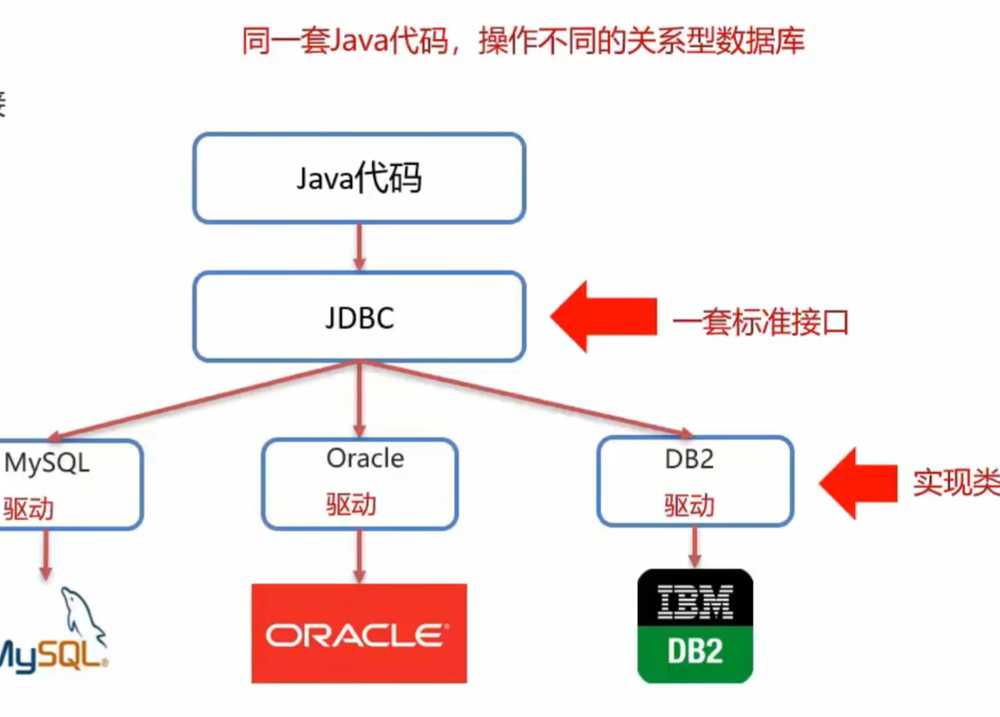

# 一、多表查询
## 1）简介
利用外键约束中的两个表[外键约束-例子](2.MySQL概述-SQL-约束-数据库设计.md#（3）%20例子)为示例。

代码示例：
```sql
-- 多表查询  
select * from emp, dept;  
  
-- 笛卡尔积:  有A,B两个集合,取A,B的所有组合情况.  
-- 重要点:  消除无效数据  
  
-- 可以修改条件:  
select * from emp,dept where dep_id = dept.id;
```
- 多表查询：从多张表查询数据
	1. 连接查询
	- 内连接：相当于查询A B交集数据
	- 外连接：
		- 左外连接：相当于查询A表所有数据和交集部分数据
		- 右外连接：相当于查询B表所有数据和交集部分数据
	2. 子查询
## 2）内连接
1. 内连接查询语法
```sql
--隐式内连接
SELECT 字段列表 FROM 表1,表2... WHERE 条件;

--显式内连接
SELECT 字段列表  FROM 表1 [INNER] JOIN 表2 ON 条件;
```
内连接相当于查询A B 交集数据。
代码示例：
```sql
-- 隐式内连接  
select * from emp, dept where emp.dep_id = dept.id;
-- 查询emp的name, age，dept表的dep_name  
select emp.name, emp.age, dept.dep_name from emp,dept where emp.dep_id = dept.id;

-- 显式内连接
select * from emp join dept on emp.dep_id = dept.id; 
```
## 3）外连接
1. 外连接查询语法
```sql
--左外连接
SELECT 字段列表 FROM 表1 LEFT [OUTER] JOIN 表2 ON 条件;

--右外连接
SELECT 字段列表 FROM 表1 RIGHT [OUTER] JOIN 表2 ON 条件;
```
- 左外连接：相当于查询A表所有数据和交集部分数据
- 右外连接：相当于查询B表所有数据和交集部分数据
代码示例：
```sql
-- 左外连接  
-- 查询emp表所有数据和对应的部门信息  
select * from emp left join dept on emp.dep_id = dept.id;  
  
-- 右外连接  
-- 查询dept表所有数据和对应的员工信息  
select * from emp right join dept on emp.dep_id = dept.id;
```
## 4）子查询
1. 子查询概念：
	- 查询中嵌套查询，称嵌套查询为子查询
2. 子查询根据查询结果不同，作用不同：


```sql
代码示例：
```sql
-- 查询年龄高于赵六的员工信息  
-- 1.查询赵六的年龄  
select age from emp where name = '赵六';  
-- 2.查询年龄大于赵六的员工信息  
select * from emp where age > 20;  
  
-- 3.合成  
select * from emp, dept where age > (select age from emp where name = '赵六') and emp.dep_id = dept.id;

-- 查询‘销售部’和‘研发部’所有的员工信息  
-- 查询‘销售部’所有的员工信息  
select * from emp where dep_id in (select dept.id from dept where dep_name = '销售部' or dep_name = '研发部');  
select * from emp where dep_id = (select dept.id from dept where dep_name = '销售部');

-- 查询入职日期是‘2011-11-11’之后的员工信息和部门信息  
-- 查询入职日期是‘2011-11-11’之后的员工信息
select * from emp where entrydate > '2011-11-11';

-- 合成  
select * from (select * from emp where entrydate > '2011-11-11') t1,dept where t1.dep_id = dept.id;
```
# 二、事务
- 数据库的事务是一种机制、一个操作序列，包含了一组数据库操作命令
- 事务把所有的命令作为一个整体一起向系统提交或撤销操作请求，即这一组数据库命令要么同时成功，要么同时失败
- 事务是一个不可分割的工作逻辑单元
具体示例如图所示:

语法：
```sql
-- 开启事务
START TRANSACTION;
或者 BEGIN;
-- 提交事务
COMMIT;
--回滚事务
ROLLBACK;
```
代码示例:
```sql
-- 创建列表  
create table account (  
    id int primary key auto_increment,  
    name varchar(10),  
    money double(10,2)  
);  
  
-- 添加数据  
insert into account(name, money) values ('张三', 1000), ('李四', 1000);  
  
select * from account;  
update account set money = 1000;  
  
-- 转账操作  
begin;  
-- 1.查询李四的余额  
select money from account where name = '李四';  
-- 2.李四金额 -500
update account set money = money - 500 where name = '李四';  
-- 3.张三金额 +500
update account set money = money + 500 where name = '张三';  
-- 4.提交事务  
commit;  
-- 5.若不正确可以回滚事务  
rollback;
```
# 三、JDBC
## 1）简介
JDBC概念：
- JDBC就是使用java语言操作关系型数据库的一套API
- 全称：（Java DataBase Connectivity）Java数据库连接
JDBC本质：
- 官方定义的一套操作所有关系型数据库的规则，即接口
- 各个数据库厂商去实现这套接口，提供数据库驱动jar包
- 我们可以使用这套接口（JDBC）编程，真正执行的代码是驱动jar包中的实现类。
JDBC好处：
- 各数据库厂商使用相同的接口，Java代码不需要针对不同数据库分别开发
- 可随时替换底层数据库，访问数据库的Java代码基本不变

## 2）JDBC快速入门
步骤：
0.创建工程，导入驱动jar包
1.注册驱动
```sql
Class.forName("com.mysql.jdbc.Driver");
```
2.获取连接
```sql
Connection conn = DriverManager.getConnection(url, username, password);
```
3.定义SQL语句
```sql
String sql = "update...";
```
4.获取执行SQL对象
```sql
Statement stmt = conn.createStatement();
```
5.执行SQL
```sql
stmt.executeUpdate(sql);
```
6.处理返回结果
7.释放资源