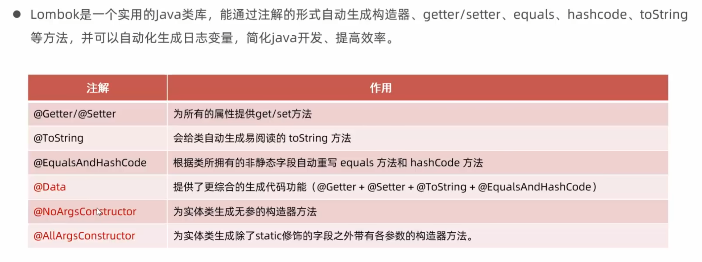

# 一、MyBatis
## 1）MyBatis入门
### （1）快速入门
步骤：使用MyBatis查询所有用户数据
1. 准备工作（创建springboot工程、数据库表user、实体类User）
- 创建模块，选择Spring Boot生成器，**类型选择Maven**，下一步。
- 然后选择springboot版本为3.4.7，在SQL中选择Mybatis framework，然后选择mysql driver。
- 创建一个User实体类。
2. 引入Mybatis的相关依赖，配置Mybatis（数据库连接信息）
```yml
#配置数据库的连接信息 - 四要素  
#驱动类名称  
spring.datasource.driver-class-name=com.mysql.cj.jdbc.Driver  
#数据库连接的url  
spring.datasource.url = jdbc:mysql://localhost:3306/mybatis  
#连接数据库的用户名  
spring.datasource.username=root  
#连接数据库的密码  
spring.datasource.password=1234
```
接下来，配置代码如下：
MybatisApplicationTests测试类:  
```java
package com.itheima.mybatis;  
  
import com.itheima.mybatis.mapper.UserMapper;  
import com.itheima.mybatis.pojo.User;  
import org.junit.jupiter.api.Test;  
import org.springframework.beans.factory.annotation.Autowired;  
import org.springframework.boot.test.context.SpringBootTest;  
  
import java.util.List;  
  
@SpringBootTest  //springboot整合单元测试的注释  
class MybatisApplicationTests {  
    @Autowired  
    private UserMapper UserMapper;  
  
    @Test  
    void contextLoads() {  
        List<User> userList = UserMapper.list();  
        userList.stream().forEach(User -> {  
            System.out.println(User);  
        });  
    }  
}
```
User类:
```java
package com.itheima.mybatis.pojo;  
  
public class User {  
    private int id;  
    private String name;  
    private int age;  
    private String gender;  
    private String phone_number;  
  
    public User() {}  
  
    public User(String name, int age, String gender, String phone_number, int id) {  
        this.name = name;  
        this.age = age;  
        this.gender = gender;  
        this.phone_number = phone_number;  
        this.id = id;  
    }  
  
    public int getId() {  
        return id;  
    }  
  
    public void setId(int id) {  
        this.id = id;  
    }  
  
    public String getName() {  
        return name;  
    }  
  
    public void setName(String name) {  
        this.name = name;  
    }  
  
    public int getAge() {  
        return age;  
    }  
  
    public void setAge(int age) {  
        this.age = age;  
    }  
  
    public String getGender() {  
        return gender;  
    }  
  
    public void setGender(String gender) {  
        this.gender = gender;  
    }  
  
    public String getPhone_number() {  
        return phone_number;  
    }  
  
    public void setPhone_number(String phone_number) {  
        this.phone_number = phone_number;  
    }  
  
    @Override  
    public String toString() {  
        return "User{" +  
                "name='" + name + '\'' +  
                ", age=" + age +  
                ", gender='" + gender + '\'' +  
                ", phone_number='" + phone_number + '\'' +  
                ", id=" + id +  
                '}';  
    }  
}
```
3. 编写SQL语句（注解/XML）
UserMapper接口:
```java
package com.itheima.mybatis.mapper;  
  
import com.itheima.mybatis.pojo.User;  
import org.apache.ibatis.annotations.Mapper;  
import org.apache.ibatis.annotations.Select;  
  
import java.util.List;  
  
@Mapper  //在运行是，会自动生成该接口的类对象，并且将该对象交给IOC容器管理  
public interface UserMapper {  
    //查询全部用户信息  
    @Select("select * from user")  
    public List<User> list();  
}
```
@select后面即操作数据库的sql语句。
### （2）JDBC介绍
jdbc程序：
1. 注册驱动
2. 获取连接
3. 获取执行sql的对象Statement，执行sql
4. 释放资源
### （3）数据库连接池
- 数据库连接池是个容器，负责分配、管理数据库连接
- 它允许应用程序重复使用一个现有的数据库连接，而不是再重新建立一个
- 释放空闲时间超过最大空闲时间的连接，来避免因为没有释放连接而引起的数据库连接遗漏
**优势：**
- 资源重用
- 提升系统相应速度
- 避免数据库连接泄露

**标准接口：DataSource**
- 官方（sun）提供的数据库连接池接口，由第三方组织实现此接口。
- 功能：获取连接
语法：
```java
Connection getConnection() throws SQLException;
```
- 常见产品：
C3P0、DBCP、Druid、Hikari
- 切换Druid数据库连接池
官方地址: [Druid](https://github.com/alibaba/druid/tree/master/druid-spring-boot-starter)
在pom.xml中配置：
```xml
<!--    druid数据库连接池    -->  
<dependency>  
    <groupId>com.alibaba</groupId>  
    <artifactId>druid-spring-boot-starter</artifactId>  
    <version>1.2.8</version>  
</dependency>
```
### （4）lombok

所以新的实体User就为：
```java
package com.itheima.mybatis.pojo;  
import lombok.*;  
  
  
//@Getter        )  
//@Setter            )   ==   @Data  
//@ToString     )  
//@EqualsAndHashCode  
  
@Data  
@NoArgsConstructor  //无参构造  
@AllArgsConstructor  //全参构造  
public class User {  
    private int id;  
    private String name;  
    private int age;  
    private String gender;  
    private String phoneNumber;
```
# 二、Mybatis基础操作
## 1）Demo示例
需求说明
根据资料中提供的《tlias智能学习辅助系统》页面原型及需求，完成员工管理的需求开发。
### 功能列表
查询
- 根据主键ID查询
- 条件查询
新增
更新
删除
- 根据主键ID删除
- 根据主键ID批量删除
## 2）准备工作
- 准备数据库表emp
- 创建一个新的springboot工程，选择引入对应的起步依赖（mybatis、mysql驱动、lombok）
- application.properties中引入数据库连接信息
- 创建对应的实体类Emp（实体类属性采用驼峰命名）
- 准备Mapper接口 EmpMapper
代码略。
## 3）删除操作
### （1）根据主键删除
根据传进来的id动态删除数据
Mybatis动态传值语法为：`#{变量名}`
代码示例：
Mapper部分：
```java
//根据id删除数据  
@Delete("delete from emp where id = #{id}")  
public void delete(int id);
```
测试类：
```java
package com.itheima.mybatisdemo;  
  
import com.itheima.mybatisdemo.mapper.EmpMapper;  
import com.itheima.mybatisdemo.project.Emp;  
import org.junit.jupiter.api.Test;  
import org.springframework.beans.factory.annotation.Autowired;  
import org.springframework.boot.test.context.SpringBootTest;  
import java.util.List;  
  
@SpringBootTest  
class MybatisDemoApplicationTests {  
    @Autowired  
    private EmpMapper EmpMapper;  
  
    public void testDelete(){  
        EmpMapper.delete(17);  
    }  
}
```
这样就可以根据id删除用户信息了。
稍微修改一下，就可以看影响的行数。
Mapper部分：
```java
//根据id删除数据  
@Delete("delete from emp where id = #{id}")  
public int delete(int id);
```
测试类：
```java
@SpringBootTest  
class MybatisDemoApplicationTests {  
    @Autowired  
    private EmpMapper EmpMapper;  
  
    @Test  
    //删除类  
    public void testDelete(){  
        int delete = EmpMapper.delete(16);  
        System.out.println(delete);  
    }  
}
```
一般选择前者不返回数据的方案。
sql执行日志输出：
- 可以再application.properties中，打开mybatis的日志，并指定输出到控制台。
```yml
#指定mybatis输出日志的位置，输出控制台
mybatis.configuration.log-impl = org.apache.ibatis.logging.stdout.StdOutImpl
```
输出以下日志：
```shell
==>  Preparing: delete from emp where id = ?
==> Parameters: 16(Integer)
<==    Updates: 1
```
### （2）删除（预编译SQL）
预编译SQL的优势：
- 性能更高
- 更安全（防止SQL注入）
SQL注入
- **SQL注入**是通过操作输入的数据来修改事先定义好的SQL语句，以达到执行代码对服务器进行攻击的方法。
示例：在如图所示的后台管理系统中，如图输入：

将此输入内容键入以下sql语句：
```sql
-- 登录  
select count(*) from emp where username = 'zhangwuji' and password = ' ' or '1' = '1';
```
结果肯定返回1，从而登录成功。
为了解决这个问题，我们要预编译sql，上述`#{}`的结构，就是预编译sql。
## 4）新建操作
### （1）介绍
对于EmpMapper的操作示例：
```java
package com.itheima.mybatisdemo.mapper;  
  
import com.itheima.mybatisdemo.project.Emp;  
import org.apache.ibatis.annotations.Delete;  
import org.apache.ibatis.annotations.Insert;  
import org.apache.ibatis.annotations.Mapper;  
import org.apache.ibatis.annotations.Select;  
  
import java.util.List;  
  
@Mapper  
public interface EmpMapper {  
    //根据id动态删除数据  
//    @Delete("delete from emp where id = #{id}")  
//    public void delete(int id);  
  
    //新增员工  
    @Insert("insert into emp(id, username, name, gender, image, job, entrydate, dept_id, create_time, update_time)" +  
                "values (#{id},#{username},#{name},#{gender},#{image},#{job},#{entrydate},#{deptId},#{createTime},#{updateTime})")  
    public void insert(Emp emp);  
}
```
新知识点：因为数据太多，所以可以直接使用Emp对象来传递各项员工数据。同样使用`#{}`来进行编译。
测试类方法：
```java
//添加类  
public void testIncert(){  
    Emp emp = new Emp();  
    emp.setId(16);  
    emp.setUsername("Tom");  
    emp.setName("汤姆");  
    emp.setImage("1.jpg");  
    emp.setGender((short)1);  
    emp.setJob((short)1);  
    emp.setEntrydate(LocalDate.of(2025,07,15));  
    emp.setCreateTime(LocalDateTime.now());  
    emp.setUpdateTime(LocalDateTime.now());  
    emp.setDeptId(1);  
  
    //执行新增员工信息操作  
    EmpMapper.insert(emp);  
}
```
通过就地构造一个类，我们可以直观地创建员工的数据。
### （2）主键返回
- 描述：在数据添加成功后，需要获取插入数据库数据的主键。如：添加套餐数据是，还需要维护套餐菜品关系表数据。
测试类代码：
```java
public void testIncert(){  
    Emp emp = new Emp();  
    emp.setUsername("Tom3");  
    emp.setName("汤姆");  
    emp.setImage("1.jpg");  
    emp.setGender((short)1);  
    emp.setJob((short)1);  
    emp.setEntrydate(LocalDate.of(2025,07,15));  
    emp.setCreateTime(LocalDateTime.now());  
    emp.setUpdateTime(LocalDateTime.now());  
    emp.setDeptId(1);

	//执行新增员工信息操作  
	EmpMapper.insert(emp);  
	System.out.println(emp.getId());
}
```
getId值为0，因为我们并没有设置emp类中id的具体值。
解决方法：
在EmpMapper中，加入：
```java
@Options(useGeneratedKeys = true, keyProperty = "id")
@Insert("insert into emp(username, name, gender, image, job, entrydate, dept_id, create_time, update_time)" +  
            "values (#{username},#{name},#{gender},#{image},#{job},#{entrydate},#{deptId},#{createTime},#{updateTime})")  
public void insert(Emp emp);
```
即可返回id值。
## 5）更新操作
### （1）介绍
在新建操作的基础上进行修改：
 EmpMapper接口：
 ```java
 //更新操作  
@Update("update emp set username = #{username}, name = #{name}, gender = #{gender}, image = #{image}, job = #{job}, entrydate = #{entrydate}, dept_id = #{deptId}, update_time = #{updateTime} where id = #{id}")  
public int update(Emp emp);
```
测试类：
```java
//添加类  
public void testIncert(){  
    Emp emp = new Emp();  
    emp.setId(1);  
    emp.setUsername("Tommao");  
    emp.setName("汤姆dada");  
    emp.setImage("1.jpg");  
    emp.setGender((short)1);  
    emp.setJob((short)1);  
    emp.setEntrydate(LocalDate.of(2025,07,15));  
    emp.setUpdateTime(LocalDateTime.now());  
    emp.setDeptId(1);  
  
    //执行新增员工信息操作  
    EmpMapper.update(emp);  
    System.out.println(emp.getId());  
}
```
## 6）查询操作
### （1）根据ID查询
根据ID查询员工：
EmpMapper如下：
```java
//查询操作  
@Select("select * from emp where id = #{id}")  
public Emp getById(int id);
```
测试类如下：
```java
//查询操作
public void testGetById() {  
    Emp emp = EmpMapper.getById(10);  
    System.out.println(emp);  
}
```
但是结果如下：
```shell
Emp(id=10, username=zhaomin, password=123456, name=赵敏, gender=2, image=10.jpg, job=1, entrydate=2013-09-05, deptId=0, createTime=null, updateTime=null)
```
createTime和updateTime为null。这是为什么呢？
#### 数据封装
- 实体类属性名 和 数据库表查询返回的字段名一致，mybatis会自动封装。
- 如果实体类属性名 和 数据库表查询返回的字段名不一致，不能自动封装。
其中deptId、createTime和updateTime与数据库中的字段名并不一致，所以不能自动封装。
#### 解决方案
- 方案一示例：
```java
//方案一：给字段起别名，让别名与实体类属性一致  
@Select("select id, username, password, name, gender, image, job, entrydate, dept_id" +  
        "create_time createTime, update_time updateTime from emp where id = #{id}")  
public Emp getById(int id);
```
- 方案二示例：
```java
//方案二：通过@Results，@Result注解手动映射封装  
@Select("select * from emp where id = #{id}")  
@Results({  
        @Result(column = "dept_id", property = "deptId"),  
        @Result(column = "update_time", property = "updateTime"),  
        @Result(column = "create_time", property = "createTime")  
})  
public Emp getById(Integer id);
```
- 方案三：开启mybatis的驼峰命名自动映射开关
```yaml
#开启mybatis的驼峰命名自动映射开关  
mybatis.configuration.map-underscore-to-camel-case = true
```
### （2）条件查询
EmpMapper如下：
```java
//条件查询  
@Select("select * from emp where name like '%${name}%' and gender = #{gender} " +  
             "and entrydate between #{begin} and #{end} order by update_time desc")  
public List<Emp> list(String name, short gender, LocalDate begin, LocalDate end);
```
Test类如下：
```java
//条件查询  
public void testGet() {  
    List<Emp> empList = EmpMapper.list("张", (short)1, LocalDate.of(2000,1,1),LocalDate.of(2020,1,1));  
    empList.forEach(System.out::println);  
}
```
问题：EmpMapper中，`%${name}%`不是预编译sql语句，会出现性能低、不安全、存在sql注入问题。
解决方案：用`concat()`来拼接字符串。
修改如下：
```java
//条件查询  
@Select("select * from emp where name like concat and gender = #{gender} " +  
             "and entrydate between #{begin} and #{end} order by update_time desc")  
public List<Emp> list(String name, short gender, LocalDate begin, LocalDate end);
```