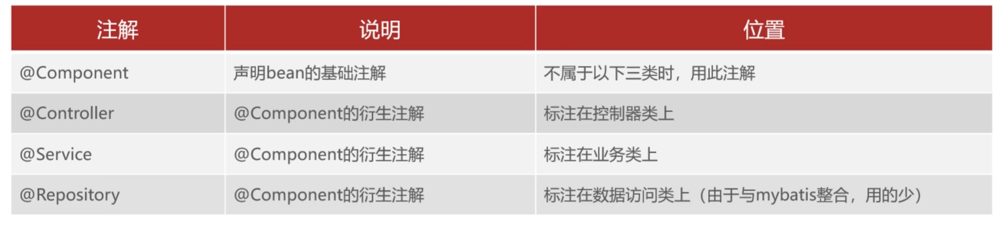

# 一、springboot介绍
## 1）简介
spring boot是spring提供地一个子项目，用于快速构建Spring应用程序
如图所示：

#### 传统方式构建spring应用程序
- 导入依赖繁琐
需要配置一堆xml依赖
- 项目配置繁琐
需要在xml中配置一堆功能。
## 2）springboot的特性
### （1）起步依赖
本质上就是一个Maven坐标，整合了完成一个功能需要的所有坐标
### （2）自动配置
遵循约定大约配置的原则，在boot程序启动后，一些bean对象会自动注入到ioc容器，不需要手动声明，简化开发（如mybatis项目中自动配置好的pom.xml）
### （3）其他特性
- 内嵌的Tomcat、Jetty（无需部署WAR文件）
- 外部化配置
- 不需要XML配置（properties/yml）（已经全部在pom.xml里了）
# 二、SpringBoot入门
## 1）经典示例
需求：使用SpringBoot开发一个web应用，浏览器发起请求/hello后，给浏览器返回字符串“hello world ~”。
#### 步骤：
1. 创建Maven工程
2. 导入spring-boot-stater-web起步依赖（在IDEA的新建springboot工程中，选择依赖中找到Web，再勾选Spring Web即可）
3. 编写Controller
4. 提供启动类（IDEA已经帮我们提供好了）
其中HelloController：
```java
package com.itheima.springbootstart.controller;  
  
import org.springframework.web.bind.annotation.RequestMapping;  
import org.springframework.web.bind.annotation.RestController;  
  
@RestController  
public class HelloController {  
    @RequestMapping("/hello")  
    public String hello() {  
        System.out.println("Hello World~");  
        return "hello world";  
    }  
}
```
测试main：
```java
package com.itheima.springbootstart;  
  
import org.springframework.boot.SpringApplication;  
import org.springframework.boot.autoconfigure.SpringBootApplication;  
import org.springframework.context.annotation.ComponentScan;  
  
@SpringBootApplication  
public class SpringBootStartApplication {  
    public static void main(String[] args) {  
        SpringApplication.run(SpringBootStartApplication.class, args);  
    }  
}
```
访问`http://localhost:8080/hello`，就可以看到hello world导入页面了。
## 2）手动创建Springboot工程
步骤：
1. 创建Maven工程
在IDEA的构建模块中，选择Maven Archetype。在Archetype中，选择`org.apache.maven.archetypes:maven-archetype-quickstart`骨架，点击创建
2. 引入依赖
加入以下依赖：
```xml
<!--  须加入的依赖-->  
  <parent>  
    <groupId>org.springframework.boot</groupId>  
    <artifactId>spring-boot-starter-parent</artifactId>  
    <version>3.5.3</version>  
  </parent>

<!--    需加入的依赖（dependencies里面）     -->  
    <dependency>  
      <groupId>org.springframework.boot</groupId>  
      <artifactId>spring-boot-starter</artifactId>  
    </dependency>
```
3. 提供启动类
将App更名为SpringBootCreateManualApplication，加入注解然后构建：
```java
@SpringBootApplication  
public class SpringBootCreateManualApplication {  
    public static void main(String[] args) {  
        SpringApplication.run(SpringBootCreateManualApplication.class, args);  
    }  
}
```
即可手动建立SpringBoot工程。
## 3）配置文件
### （1）properties配置文件
关于application.properties：
上述hello world例子中，如果我们想把8080端口改为9090，把context path改为'/start'，我们就要用application.properties来修改。
语法示例：
```properties
server.port=9090
server.servlet.context-path=/start
```
修改后，想要访问hello world页面，只能够通过 [这个链接](http://localhost:9090/start/hello)访问。
### （2）配置文件格式
- SpringBoot提供了多种属性配置方式
	- application.properties
	- application.yml / application.yaml
语法示例：
```yml
server:
 port:9191
 servlet:
  context-path: /start2
```
显然第二种更加简洁好用，故在实际开发中，优先用yml配置文件。
### （3）yml配置信息书写与读取
步骤：
1. 三方技术配置信息
2. 自定义配置信息
案例：邮件发送系统。
springboot需要导入下列依赖：
```xml
<dependency>  
    <groupId>org.springframework.boot</groupId>  
    <artifactId>spring-boot-starter-mail</artifactId>  
</dependency>  
<dependency>  
    <groupId>org.springframework.boot</groupId>  
    <artifactId>spring-boot-starter-web</artifactId>  
</dependency>
```
一个是收发邮件的API，一个是Web依赖。
在发邮件的类中，有：发件人邮箱、授权码、发件人邮箱对应的应用服务、身份验证等信息。
这个时候我们可以将这些信息转到application.properties上：
```properties
email.user = xxxx@qq.com
email.code = xxxx
email.host = xxxx
email.auth = true
```
或者
```yml
email:
 user: xxxxx
 code: xxxx
 host: xxxxx
 auth: true
```
**注意点：**
- 值前面必须有空格，作为分隔符
- 使用空格作为缩进表示层级关系，相同的层级左侧对齐
想要把配置文件里面的信息导入到类中，需要以下操作：
```java
@Value("${email.user}")
public String user;
//其他以此类推
```
也可以在类名前面添加注解：`@ConfigurationProperties(prefix = "email")`
## 4）整合mybatis
**注：package = com.itheima.springbootmybatis**
项目代码如下：
package.controller.EmpController：
```java
package com.itheima.springbootmybatis.controller;  
  
import com.itheima.springbootmybatis.pojo.Emp;  
import com.itheima.springbootmybatis.service.EmpService;  
import org.springframework.beans.factory.annotation.Autowired;  
import org.springframework.web.bind.annotation.RequestMapping;  
import org.springframework.web.bind.annotation.RestController;  
  
@RestController  
public class EmpController {  
    @Autowired  
    private EmpService empService;  
  
  
    @RequestMapping("/info")  
    public Emp findById(Integer id) {  
        return empService.getById(10);  
    }  
}
```
package.mapper.EmpMapper：
```java
package com.itheima.springbootmybatis.mapper;  
  
import com.itheima.springbootmybatis.pojo.Emp;  
import org.apache.ibatis.annotations.Mapper;  
import org.apache.ibatis.annotations.Select;  
  
@Mapper  
public interface EmpMapper {  
    @Select("select id, username, password, name, gender, image, job, entrydate, dept_id, " +  
            "create_time createTime, update_time updateTime from emp where id = #{id}")  
    public Emp getById(Integer id);  
}
```
Emp对象：
```java
package com.itheima.springbootmybatis.pojo;  
  
import lombok.AllArgsConstructor;  
import lombok.Data;  
import lombok.NoArgsConstructor;  
  
import java.time.LocalDate;  
import java.time.LocalDateTime;  
  
@Data  
@AllArgsConstructor  
@NoArgsConstructor  
public class Emp {  
    private int id;  
    private String username;  
    private String password;  
    private String name;  
    private short gender;  
    private String image;  
    private short job;  
    private LocalDate entrydate;  
    private int deptId;  
    private LocalDateTime createTime;  
    private LocalDateTime updateTime;  
}
```
package.service.impl.EmpServiceImpl：
```java
package com.itheima.springbootmybatis.service.impl;  
  
import com.itheima.springbootmybatis.mapper.EmpMapper;  
import com.itheima.springbootmybatis.pojo.Emp;  
import com.itheima.springbootmybatis.service.EmpService;  
import org.springframework.beans.factory.annotation.Autowired;  
import org.springframework.stereotype.Service;  
  
@Service  
public class EmpServiceImpl implements EmpService {  
    @Autowired  
    private EmpMapper empMapper;  
  
    public Emp getById(Integer id) {  
        return empMapper.getById(id);  
    }  
}
```
package.service.Empservice：
```java
package com.itheima.springbootmybatis.service;  
  
import com.itheima.springbootmybatis.pojo.Emp;  
  
public interface EmpService {  
    public Emp getById(Integer id);  
}
```
application.yml:
```yml
spring:  
  datasource:  
    driver-class-name: com.mysql.cj.jdbc.Driver  
    url: jdbc:mysql://localhost:3306/mybatis  
    username: root  
    password: 123456
```
## 5）Bean管理
### （1）Bean对象扫描
- 标签：`<context:component-scan base-package="com.itheima"/>`
- 注解：`@ComponentScan(basePackages = "com.itheima")`
### （2）Bean注册

如果要注册的bean对象来自于第三方（不是自定义的），是无法用@Component及衍生注解声明bean的。
需要自己导入jar包进去，才可以声明。
### （3）注册条件
Springboot提供了设置注册生效条件的注解@Conditional

| 注解                        | 说明                      |
| ------------------------- | ----------------------- |
| @ConditionalOnProperty    | 配置文件中存在对应的属性，才声明该bean   |
| @ConditionalOnMissingBean | 当不存在当前类型的bean时，才声明该bean |
| @ConditionalClass         | 当前环境存在指定的这个类时，才声明该bean  |
## 6）自动配置原理
遵循约定大约配置的原则，在boot程序启动后，起步依赖中的一些bean对象会自动注入到ioc容器
代码示例：
 启动类：
```java
package com.itheima.springbootautoconfig;  
  
import org.springframework.boot.SpringApplication;  
import org.springframework.boot.autoconfigure.SpringBootApplication;  
import org.springframework.context.ApplicationContext;  
  
@SpringBootApplication  
public class SpringbootAutoConfigApplication {  
  
    public static void main(String[] args) {  
        ApplicationContext context = SpringApplication.run(SpringbootAutoConfigApplication.class, args);  
        System.out.println(context.getBean("dispatcherServlet"));  
    }  
}
```
pom.xml：
```java
<dependency>  
    <groupId>org.springframework.boot</groupId>  
    <artifactId>spring-boot-starter-web</artifactId>  
</dependency>
```
JVM:
```shell
org.springframework.web.servlet.DispatcherServlet@b606cb6
```
## 7）自定义starter
场景：
- 在实际开发中，经常会定义一些公共组件，提供给各个项目团队使用。而在SpringBoot的项目中，一般会将这些公共组件封装为SpringBoot的Starter。
代码示例：
自动配置类
```java
package com.itheima.config;  
  
import org.apache.ibatis.annotations.Mapper;  
import org.mybatis.spring.SqlSessionFactoryBean;  
import org.mybatis.spring.mapper.MapperScannerConfigurer;  
import org.springframework.beans.factory.BeanFactory;  
import org.springframework.boot.autoconfigure.AutoConfiguration;  
import org.springframework.boot.autoconfigure.AutoConfigurationPackages;  
import org.springframework.context.annotation.Bean;  
  
import javax.sql.DataSource;  
import java.util.List;  
  
@AutoConfiguration   //表示当前类是一个自动配置类  
public class MyBatisAutoConfig {  
  
    //SqlSessionFactoryBean  
    @Bean  
    public SqlSessionFactoryBean sqlSessionFactoryBean(DataSource dataSource) {  
        SqlSessionFactoryBean sqlSessionFactoryBean = new SqlSessionFactoryBean();  
        sqlSessionFactoryBean.setDataSource(dataSource);  
        return sqlSessionFactoryBean;  
    }  
  
    //MapperScannerConfigure  
    public MapperScannerConfigurer mapperScannerConfigurer(BeanFactory beanFactory) {  
        MapperScannerConfigurer mapperScannerConfigurer = new MapperScannerConfigurer();  
        //扫描的包：启动类所在的包及其子包  
        List<String> packages = AutoConfigurationPackages.get(beanFactory);  
        String p  = packages.get(0);  
        mapperScannerConfigurer.setBasePackage(p);  
  
        //扫描的注解  
        mapperScannerConfigurer.setAnnotationClass(Mapper.class);  
        return mapperScannerConfigurer;  
    }  
}
```
在springboot-mybatis的pom.xml中，加入
```java
<!--        自定义的mybatis启动依赖        -->
<dependency>  
    <groupId>com.itheima</groupId>  
    <artifactId>dmybatis-spring-boot-starter</artifactId>  
    <version>1.0-SNAPSHOT</version>  
</dependency>
```
发现可以正常读取数据库。
