# 一、数据模型
## 1）关系型数据库
概念：建立在关系模型基础上，由多张相互连接的二维表组成的数据库。
特点：
1. 使用表存储数据，格式统一，便于维护
2. 使用SQL语言操作，标准统一，使用方便
## 2）MySQL数据库
如图所示：
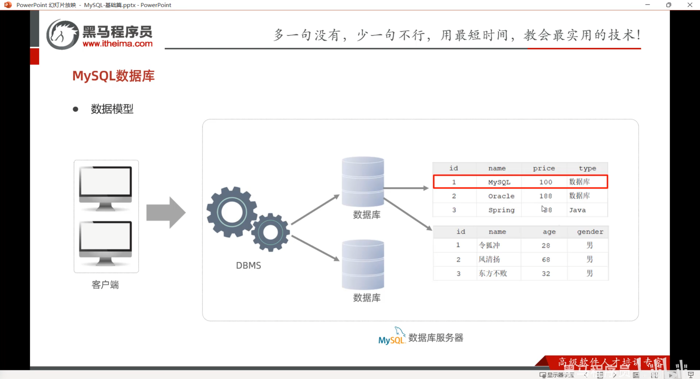
# 二、图形化界面工具
## 1）DataGrip配置MySQL
用户填root，密码填默认密码。
**重要：高级中，要填`allowPublicKeyRetrieval`**
## 2）DG创建表格
如图所示：
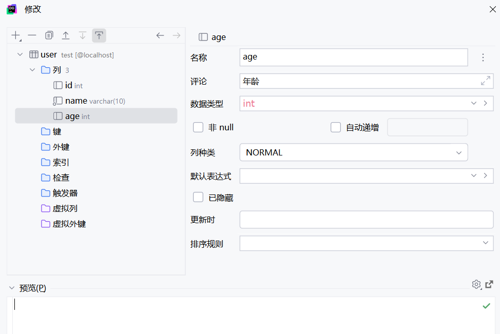

可以写完指令后点击运行：
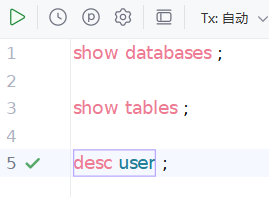
# 三、SQL
## 1）SQL的通用语法
1. SQL语句可以单行或多行书写，以分号结尾。
2. SQL语句可以使用空格/缩进来增强语句的可读性。
3. MySQL数据库的SQL语句不区分大小写，关键字建议使用大写。
4. 注释：
	- 单行注释：--或#
	- 多行：/\*注释内容\*/
## 2）SQL分类
分类如下：
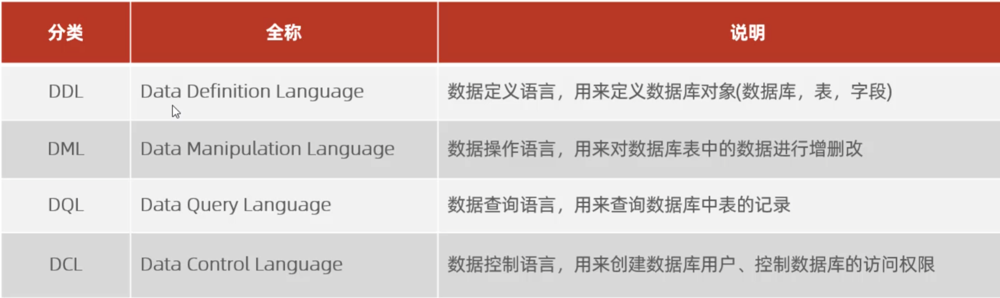
## 3）DDL
### （1）DDL-数据库操作
- 查询
	查询所有数据库：
	`SHOW DATABASES;`
	查询当前数据库：
	`SELECT DATABASE();`
	创建：
	`CREATE DATABASE [IF NOT EXISTS] 数据库名 
	`[DEFAULT CHARSET 字符集] `
	`[COLLATE 排序规则];`
	排序规则：(通用：utf8mb4_general_ci 区分大小写：utf8mb4_unicode_ci )
	删除：
	`DROP DATABASE [IF EXISTS] 数据库名;`
	使用：
	`USE 数据库名;`
### （2）DDL-表操作-查询
- 查询当前数据库所有表
	`show tables;`
- 查询表结构
	`desc 表名;`
- 查询指定表的建表语句
	`show create table 表名;`
### （3）DDL-表操作-创建
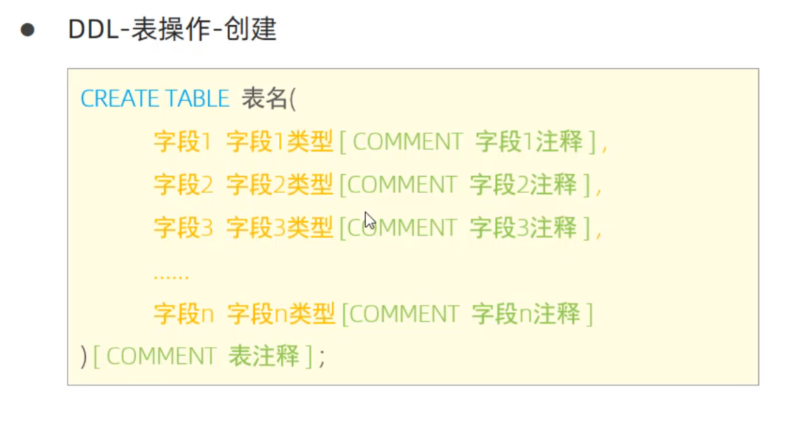
### （4）DDL-表操作-数据类型
MySQL中的数据类型很多，主要分为三类：数值类型、字符串类型、日期时间类型。
数值类型：

|     类型      |   大小    |     描述     |
| :---------: | :-----: | :--------: |
|   TINYINT   | 1 byte  |    小整数值    |
|  SMALLINT   | 2 bytes |    大整数值    |
|  MEDIUMINT  | 3 bytes |    大整数值    |
| INT或INTEGER | 4 bytes |    大整数值    |
|   BIGINT    | 8 bytes |   极大整数值    |
|    FLOAT    | 4 bytes |  单精度浮点数值   |
|   DOUBLE    | 8 bytes |  双精度浮点数值   |
|   DECIMAL   |         | 小数值（精确定点数） |

字符串类型：
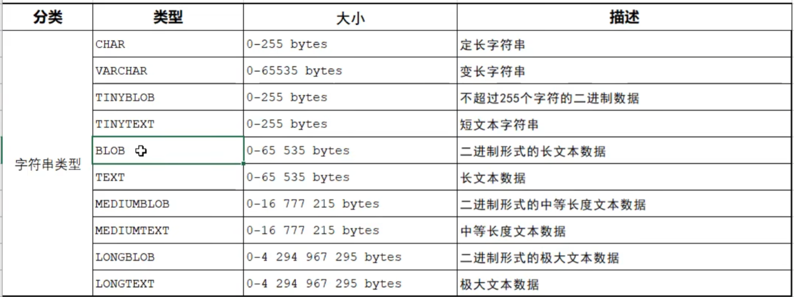
日期类型：
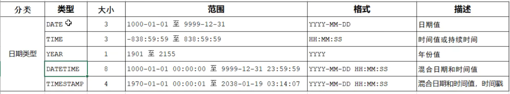
案例：
```sql
create table officers(
    id int comment "id", 
    number varchar(10) comment "number",  
    name varchar(10) comment "name",     
    sexual varchar(1) comment "sexual",   
    age int comment "age",    
    ID_Card varchar(18) comment "idcard", 
    employed_time varchar(8) comment "employed_time"
) comment "officers_info"; 
```
### （5）DDL-表操作-修改
修改数据类型：
`ALTER TABLE 表名 MODIFY 字段名 新数据类型(长度);`

修改字段名和字段类型：
`ALTER TABLE 表名 CHANGE 旧字段名 新字段名 类型(长度)[COMMENT 注释] [约束];`

案例：将emp表的nickname字段修改为username，类型为varchar(30)
代码：
```sql
--empテーブルのnicknameフィールドをusernameに直し、データ種類はvarchar(30)
create table emp(
    nickname varchar(10)
);

--内容を直す
alter table emp change nickname username varchar(30);
```
删除字段：
`ALTER TABLE 表名 DROP 字段名;`

案例：将emp表的字段username删除
代码：
 ```sql
 alter table emp drop username;
```
前提：至少要有两个字段，否则系统会要求删除整个表格。
修改表名：
`ALTER TABLE 表名 RENAME TO 新表名;`

案例：将emp表的表名修改为employee
代码：
```sql
alter table emp rename to employee;
```
### （6）DDL-表操作-删除
删除表：
`DROP TABLE[IF EXISTS] 表名;`

删除指定表，并重新创建该表：
`TRUNCATE TABLE 表名;`

案例：删除employee表，删除并重建这张表
代码：
```sql
drop table if exists employee;
truncate table employee;
```
## 4）DML
### （1）DML-介绍
DML英文全称是Data Manipulation Language（数据操作语言），用来对数据库中表的数据记录进行增删改操作。
- 添加数据（INSERT）
- 修改数据（UPDATE）
- 删除数据（DELETE）
### （2）DML-添加数据
1. 给指定字段添加数据
`INSERT INTO 表名(字段名1,字段名2,...) VALUES(值1,值2,...);`
2. 给全部字段添加数据
`INSERT INTO 表名 VALUS(值1, 值2,...);`
3. 批量添加数据
```sql
INSERT INTO 表名(字段名1,字段名2,...)  VALUES(值1,值2,...),(值1,值2,...),(值1,值2,...);
INSERT INTO 表名 VALUES(值1,值2,...),(值1,值2,...),(值1,值2,...);
```
注意:
- 插入数据时,指定的字段顺序需要与值的顺序一一对应.
- 字符串和日期型数据应该包含在引号中. 
- 插入的数据大小,应该在字段的规定范围内.
代码:
```sql
--导入数据
insert into employee(id, workno, name, gender, age, idcard, entrydate)  
values(1, '1', 'Itcast', '男', 10, '123456789012345678', '2000-01-01');  

select * from employee;  

--快捷导入数据
insert into employee values(2, '111', 20, '1123', '男', '123', '2000-01-01');
```
### （3）DML-修改数据
`UPDATE 表名 SET 字段名1=值1,字段名2=值2,...[WHERE 条件]`
代码:
```sql
/*将名字是Itcast的id改为1*/  
update employee set id = 1 where name = 'Itcast';  
  
/*将id=1的名字改为xiaozhao*/  
update employee set name = 'xiaozhao' where id = 1;  
  
/*将所有的日期变为2020-01-01*/  
update employee set entrydate = '2020-01-01'
```
### （4）DML-删除数据
`DELETE FROM 表名 [WHERE 条件]`
代码：
```sql
/*删除所有id=1的数据*/  
delete from employee where id = 1;
```
## 5）DQL
### （1）DQL - 介绍
DQL英文全称是Data Query Language（数据查询语言），数据查询语言，用来查询数据库中表的记录。
### （2）DQL - 语法
 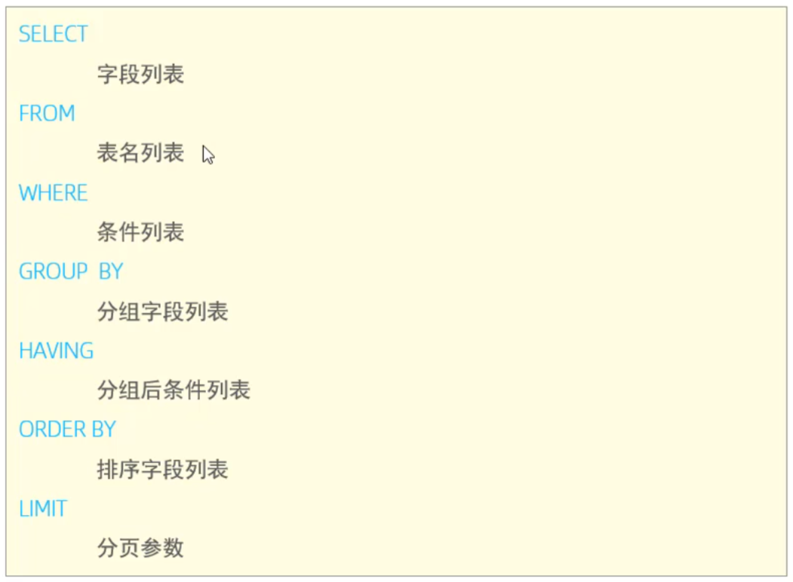
### （3）DQL - 基本查询
1. 查询多个字段
`SELECT 字段1,字段2,字段3,... FROM 表名;`
`SELECT * FROM 表名;`
2. 设置别名
`SELECT 字段1 [AS 别名1], 字段2[AS 别名2] ... FROM 表名;`
3. 去除重复记录
`SELECT DISTINCT 字段列表 FROM 表名;`
数据准备：
```sql
/*数据准备*/
INSERT INTO employee (  
    id,  
    workno,  
    name,  
    gender,  
    age,  
    idcard,  
    workaddress,  
    entrydate  
) VALUES  
      (3, '3',   'xiaohong', 'f', 22, '13800138000', 'sh', '2003-03-15'),  
      (4, '4', 'wangdachui',   'm', 25, '13900139000', 'cd', '2000-12-20'),  
      (5, '5',     'lilei',   'm', 19, '13712345678', 'hz', '2006-05-08'),  
      (6, '6', 'hanmeimei', 'f', 21, '13698765432', 'nj', '2004-07-11'),  
      (7, '7',  'sunwukong',   'm', 23, '13587654321', 'gz','2002-08-19');
```
查询代码：
```sql
/* 1.查询指定字段 name, workno,age 返回 */select name, workno, age from employee;  
  
/*2.查询所有字段返回*/  
select  id, workno, name, gender, age, idcard, workaddress, entrydate from employee;  
  
/*3.查询所有员工的工作地址*/  
select workaddress from employee;  
select workaddress '工作地址' from employee;

/*4.查询公司员工的上班地址(不要重复)*/  
select distinct workaddress '工作地址' from employee;
```
### （4）DQL - 条件查询
1. 语法
`SELECT 字段列表 FROM 表名 WHERE 条件列表;`
2. 条件
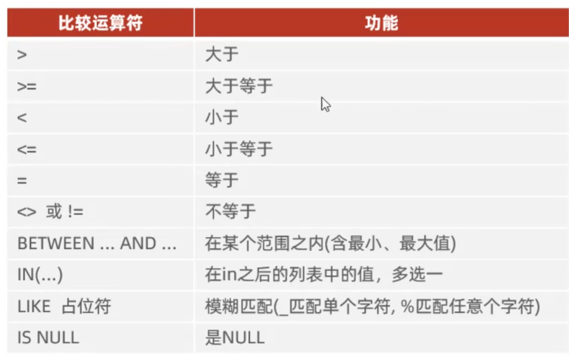
  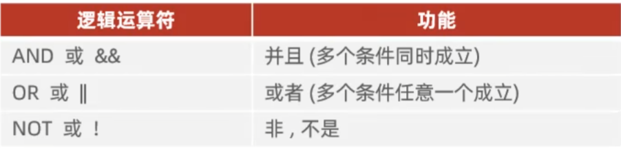
代码：
```sql
--条件查询  
-- 1. 查询年龄等于20的员工  
select * from employee where age = 20;  
-- 2. 查询年龄小于20的员工信息  
select * from employee where age < 20;  
-- 3. 查询年龄小于等于20的员工信息  
select * from employee where age <= 20;  
-- 4. 查询没有身份证号的员工信息  
select * from employee where idcard is null;  
-- 5. 查询有身份证号的员工信息  
select * from employee where idcard is null;  
-- 6. 查询年龄不等于88的员工信息  
select * from employee where age != 88;  
select * from employee where age <> 88;  
-- 7. 查询年龄在15岁（包含）到20岁（包含）之间的员工信息  
select * from employee where between 15 and 20;  
select * from employee where age >= 15 && age <= 20;  
-- 8. 查询性别为 女 且年龄小于 25岁的员工信息  
select * from employee where gender = 'fe' and age < 25;  
-- 9. 查询年龄等于18 或 20 或 40 的员工信息  
select * from employee where age = 18 or age = 20 or age = 40;  
-- 10. 查询姓名为五个字的员工信息  
select * from employee where name like '_____';  
-- 11. 查询身份证号最后一位是0的员工信息  
select * from employee where idcard like '%0';
```
### （5）DQL - 聚合函数
1. 介绍
	将一列数据作为一个整体，进行纵向计算。
2. 常见聚合函数

|  函数   |  功能  |
| :---: | :--: |
| count | 统计数量 |
|  max  | 最大值  |
|  min  | 最小值  |
|  avg  | 平均值  |
|  sum  |  求和  |
代码：
```sql
-- 聚合函数  
-- 1. 统计该企业员工数量  
select count(*) from employee;  
select count(id) from employee;  
  
-- 2. 统计该企业员工的平均年龄  
select avg(age) from employee;  
  
-- 3. 统计该企业员工的最大年龄  
select max(age) from employee;  
  
-- 4. 统计该企业员工的最小年龄  
select min(age) from employee;  
  
-- 5. 统计sh地区员工的年龄之和  
select sum(age) from employee where workaddress = 'sh';
```
### （6）DQL - 分组查询
1. 语法
`SELECT 字段列表 FROM 表名 [WHERE 条件] GROUP BY 分组字段名 [HAVING 分组后过滤条件];`
2. where与having区别
- 执行时机不同：where是分组之前进行过滤，不满足where条件，不参与分组；而having是分组之后对结果进行过滤；
- 判断条件不同：where不能对聚合函数进行判断，而having可以。
```sql
-- 聚合函数  
-- 1. 统计该企业员工数量  
select count(*) from employee;  
select count(id) from employee;  
  
-- 2. 统计该企业员工的平均年龄  
select avg(age) from employee;  
  
-- 3. 统计该企业员工的最大年龄  
select max(age) from employee;  
  
-- 4. 统计该企业员工的最小年龄  
select min(age) from employee;  
  
-- 5. 统计sh地区员工的年龄之和  
select sum(age) from employee where workaddress = 'sh';  
  
-- 分组查询  
-- 1. 根据性别分组, 统计男性员工 和 女性员工的数量  
select count(*) from employee group by gender;  
  
-- 2. 根据性别分组, 统计男性员工 和 女性员工的平均年龄  
select gender, avg(age) from employee group by gender;  
  
-- 3. 查询年龄小于45的员工, 并根据工作地址分组, 获取员工数量大于等于3的工作地址  
select workaddress, count(*) from employee where age <= 45 group by workaddress having count(*)>=3;
```
### （7）DQL - 排序查询
1. 语法
`SELECT 字段列表 FROM 表名 ORDER BY 字段1 排序方式1, 字段2 排序方式2;`
2. 排序方式
- ASC：升序（默认值）
- DESC：降序

**注意：如果是多字段排序，当第一个字段值相同时，才会根据第二个字段进行排序。**
代码：
```sql
-- 排序查询  
-- 1. 根据年龄对公司的员工进行升序排序  
select * from employee order by age asc;  
  
-- 2. 根据入职时间, 对公司的员工进行降序排序  
select * from employee order by entrydate desc;  
  
-- 3. 根据年龄对公司的员工进行升序排序, 年龄相同, 再按照入职时间进行降序排序  
select * from employee order by age asc, entrydate desc;
```
### （8）DQL - 分页查询
1. 语法
`SELECT 字段列表 FROM 表名 LIMIT 起始索引, 查询记录数;`

**注意：**
- **起始索引从0开始，起始索引=（查询页码-1）\* 每页显示记录数**
- **分页查询是数据库的方言, 不同的数据库有不同的实现, MySQL是LIMIT**
- **如果查询的是第一页数据, 起始索引可以忽略, 直接简写为limit 10**

```sql
-- 分页查询  
-- 1. 查询第一页员工数据,每页展示10条记录  
select * from employee limit 0,10;  
  
-- 2. 查询第2页员工数据, 每页展示10条记录 ---------> (页码-1)*页展示记录数  
select * from employee limit 10,10;
```
### （9）DQL - 综合案例
需求：
1. 查询年龄为20，21，22，23岁的员工信息。
2. 查询性别为 男，并且年龄在20-40（含）以内的姓名为三个字的员工。
3. 统计员工表中，年龄小于60岁的，男性员工和女性员工的人数。
代码：
```sql
-- 1. 查询年龄为20，21，22，23岁的员工信息。  
select * from employee where age in(20,21,22,23);  
-- 2. 查询性别为 男，并且年龄在20-40（含）以内的姓名为三个字的员工。  
select * from employee where gender = 'm' and ( age between 20 and 40 ) and name like '___';  
-- 3. 统计员工表中，年龄小于60岁的，男性员工和女性员工的人数。  
select gender, count(*) from employee where age < 60 group by gender;  
-- 4. 查询所有年龄小于等于35岁员工的姓名和年龄，并对查询结果按年龄升序排序，如果年龄相同按入职时间降序排序。  
select name, age from employee where age <= 35 order by age asc, entrydate desc ;  
-- 5. 查询性别为男，且年龄在20-40岁（含）以内的前5个员工信息，对查询的结果按年龄升序排序，年龄相同按入职时间升序排序。  
select * from employee where gender = 'm' and ( age between 20 and 40 ) order by age asc, entrydate asc limit 5;
```
### （10）DQL - 执行顺序
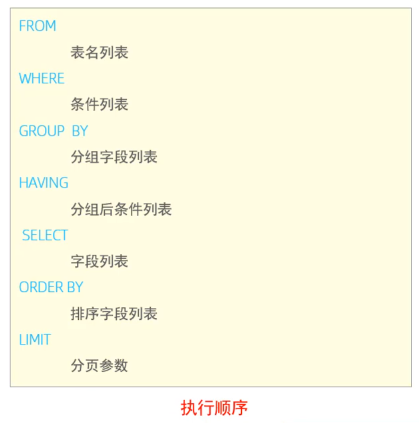

## 6）DCL
### （1）DCL-介绍
DCL英文全称是Data Control Language（数据控制语言），用来管理数据库用户，控制数据库的访问权限。
### （2）DCL-管理用户
1. 查询用户
```sql
USE mysql;
SELECT * FROM user;
```
2. 创建用户
`CREATE USER '用户名'@'主机名' IDENTIFIED BY 密码;`
3. 修改用户密码
`ALTER USER '用户名'@'主机名' IDEDTIFIED WITH mysql_native_password BY '新密码';`
4. 删除用户
`DROP USER '用户名'@'密码';`

# 四、约束
## 1）约束的概念与分类
1. 约束的概念
- 约束是作用于表中列上的规则，用于限制加入表的数据。
- 约束的存在保证了数据库中数据的正确性、有效性和完整性。
2. 约束的分类
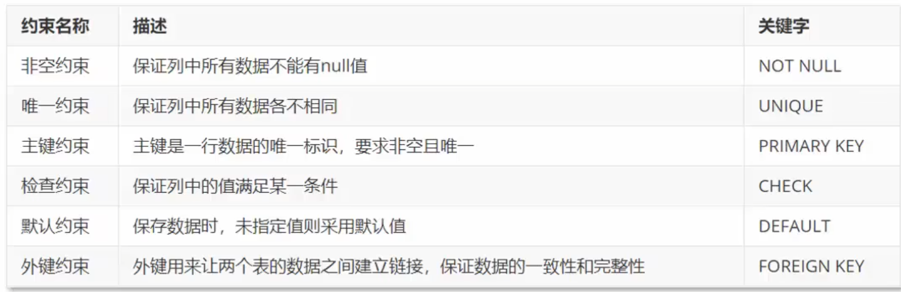
**注意:MySQL不支持检查约束**
## 2）案例示例
要求：根据需求，为表添加合适的约束
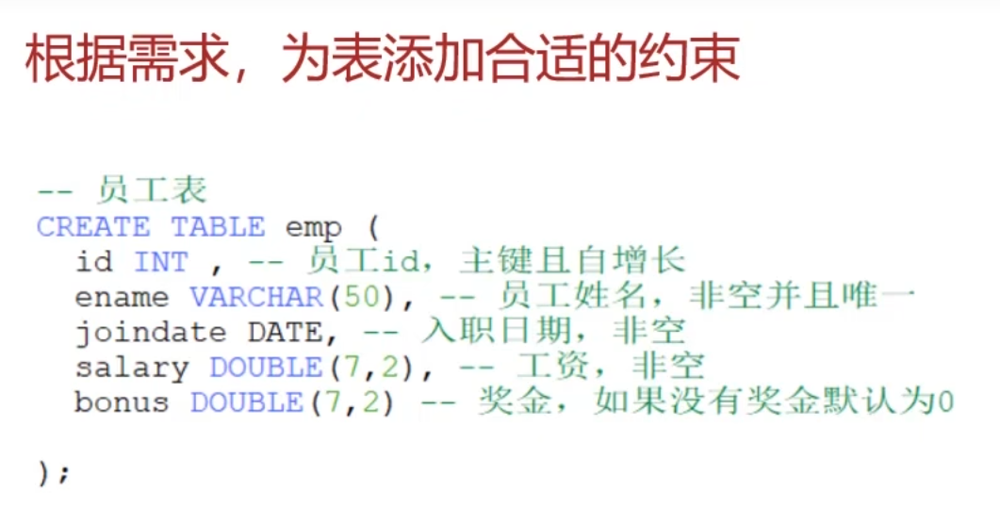
代码：
```sql
create table emp  
(  
    id int primary key,  
    ename varchar(50) not null unique,  
    joindate date not null,  
    salary double(7, 2) not null,  
    bonus double(7, 2) default 0  
);
```
1. 主键约束（非空且唯一）：
假设执行：
```sql
insert into emp(id,ename,joindate,salary,bonus)  
        values (1, '张三', '1999-11-11', 8800, 5000),  
               (1,'李四', '2000-12-12', 5000, 10000);
```
则报错：
```shell
[2025-07-11 21:47:14] [23000][1062] Duplicate entry '1' for key 'emp.PRIMARY'
```
2. 唯一约束：
执行：
```sql
insert into emp(id,ename,joindate,salary,bonus)  
        values(2,'张三', '2000-12-12', 5000, 10000);
```
则报错：
```shell
[2025-07-11 21:50:47] [23000][1062] Duplicate entry '张三' for key 'emp.ename'

```
3. 非空约束：
执行：
```sql
insert into emp(id,ename,joindate,salary,bonus)  
values (2,'李四',' ',5000, 10000);
```
报错：
```shell
[2025-07-11 21:52:26] [22001][1292] Data truncation: Incorrect date value: ' ' for column 'joindate' at row 1
```
4. 默认约束
执行：
```sql
insert into emp(id,ename,joindate,salary)  
values (2,'李四','2000-01-01',5000);
```
则：
```sql
2,李四,2000-01-01,5000,0
```
奖金自动为0
## 3）外键约束
### （1） 概念
- 外键用来让两个表的数据之间建立链接，保证数据的一致性和完整性。
### （2）语法
1. 添加约束
```sql
-- 创建表时添加外键约束
CREATE TABLE 表名(
	列名 数据类型,
	...
	[CONSTRAINT] [外键名称] FOREIGN KEY(外键列名) REFERENCES 主表(主列表名)
);

-- 建完表后添加外键约束
ALTER TABLE 表名 ADD CONSTRAINT 外键名称 FOREIGN KEY (外键字段名称) REFERENCES 主表名称(主表列名称);
```
2. 删除约束
```sql
ALTER TABLE 表名 DROP FOREIGN KEY 外键名称;
```
### （3） 例子
emp员工表如下：
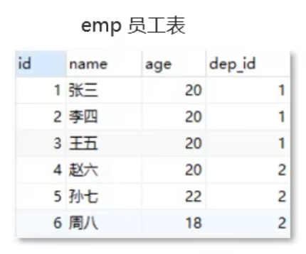
dept部门表如下：
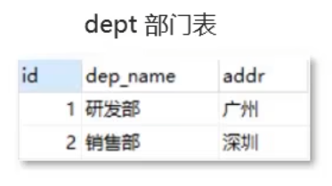
需求：使得dep_id=1的员工全部删除后，才能删除研发部。
代码：
```sql
alter table emp add constraint fk_emp_dept foreign key(dep_id) references dept(id);
```
这样，就不能随便删除id=1的部门了：
```shell
[23000][1451] Cannot delete or update a parent row: a foreign key constraint fails (`外键约束`.`emp`, CONSTRAINT `fk_emp_dept` FOREIGN KEY (`dep_id`) REFERENCES `dept` (`id`))
```
# 五、数据库设计
## 1）软件的研发步骤
