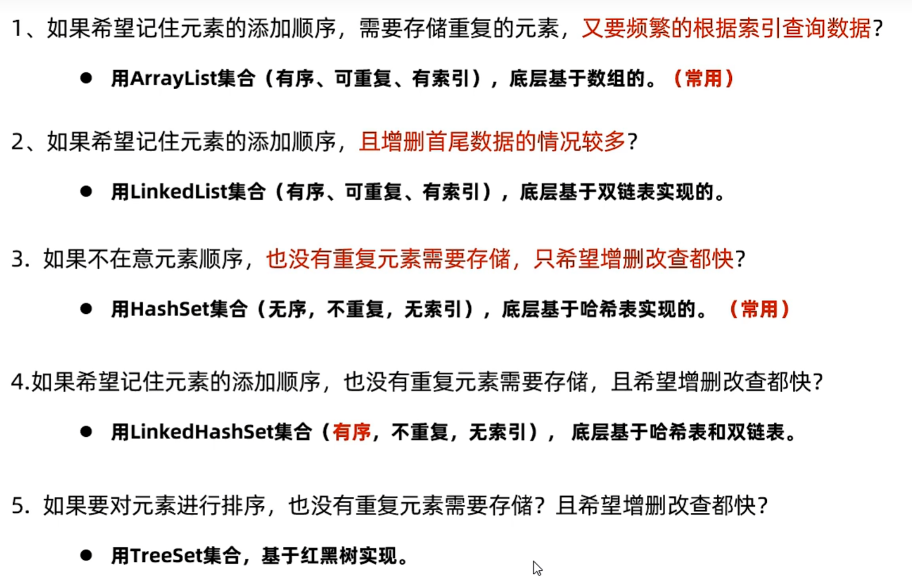

# 一、コレクションの種類
## 1）ArrayList
下記のコードのように：
```java
ArrayList<String> list = new ArrayList<>();  
list.add("java1");  
list.add("java2");  
list.add("java1");  
list.add("java2");  
System.out.println(list);
```
重複できるし、索引も支持しいている
## 2）HashSet
代码如下：
```java
//重複のエレメントを支持しないし、索引もない  
HashSet<String> set = new HashSet<>();  
set.add("java1");  
set.add("java2");  
set.add("java1");  
set.add("java3");  
System.out.println(set);
```
# 二、collection的常见操作
代码如下：
```java
package d1_collection;  
  
import java.util.ArrayList;  
import java.util.Collection;

public class CollectionTest2API {  
    public static void main(String[] args) {  
        Collection<String> collection = new ArrayList<>();  
        collection.add("java1");  
        collection.add("java1");  
        collection.add("java2");  
        collection.add("java2");  
        collection.add("java3");  
        System.out.println(collection);  
  
        //コレクションをクリア  
//        collection.clear();  
        System.out.println(collection);  
  
        //コレクションは空いているかどうか確認する  
        System.out.println(collection.isEmpty());  
  
        //コレクションのボリュームを獲得する  
        System.out.println(collection.size());  
  
        //コレクションはあるエレメントを含むかどうか確認する  
        System.out.println(collection.contains("java1"));  
  
        //ある要素を削除する  
        collection.remove("java1");  
        System.out.println(collection);  
  
        //コレクションを配列に転換する(Object類の配列だ)  
        Object[] arr = collection.toArray();  
        System.out.println(arr[1]);  
    }  
}
```
# 三、collection的遍历
## 1）迭代器
代码如下：
```java
package d2_collection_train;  
  
import java.util.ArrayList;  
import java.util.Collection;  
import java.util.Iterator;

public class CollectionDemo01 {  
    public static void main(String[] args) {  
        Collection<String> c = new ArrayList<String>();  
        c.add("佐藤さん");  
        c.add("長崎さん");  
        c.add("高松さん");  
        c.add("上原さん");  
        System.out.println(c);  
  
        //イテレータ  
        //ループを使って走査したほうがいい  
        Iterator<String> it = c.iterator();  
        while (it.hasNext()) {  
            System.out.println(it.next());  
        }  
    }  
}
```
## 2）增强for循环
代码如下：
```java
package d2_collection_train;  
import java.util.ArrayList;  
import java.util.Collection;  
import java.util.Iterator;  
  
public class CollectionDemo02 {  
    public static void main(String[] args) {  
        Collection<String> c = new ArrayList<String>();  
        c.add("佐藤さん");  
        c.add("長崎さん");  
        c.add("高松さん");  
        c.add("上原さん");  
        System.out.println(c);  
  
        //イテレータ  
        //増強forループを使って走査する  
        for(String ele : c) {  
            System.out.print(" " + ele + " ");  
        }  
        System.out.println();  
  
        //増強forループも配列を走査できる  
        String[] str = {"佐藤さん","高松さん"};  
        for(String ele : str) {  
            System.out.println(ele + " ");  
       }  
    }  
}
```
## 3）Lambda表达式
代码如下：
```java
import java.util.ArrayList;  
import java.util.Collection;  
import java.util.function.Consumer;  
  
public class CollectionDemo03 {  
    public static void main(String[] args) {  
        Collection<String> c = new ArrayList<String>();  
        c.add("佐藤さん");  
        c.add("長崎さん");  
        c.add("高松さん");  
        c.add("上原さん");  
        System.out.println(c);  
  
        //イテレータ  
        //lambda表現式で走査する  
        c.forEach(new Consumer<String>() {  
            //伝統な書き方  
            @Override  
            public void accept(String s) {  
                System.out.print(s);  
            }  
        });  
        //簡単化１  
        c.forEach(s -> System.out.println(s));  
  
        //もっと簡単化  
        c.forEach(System.out::println);  
    }  
}
```
## 4）案例1
展示多部电影信息：
主方法：
```java
import java.util.Collection;  
import java.util.ArrayList;  
  
public class CollectionTest04 {  
    public static void main(String[] args) {  
        //コレクション容器を作成する  
        Collection<Movie> movies = new ArrayList<>();  
        movies.add(new Movie("《肖申克的救赎》", 9.7, "罗宾斯"));  
        movies.add(new Movie("《肖申克救赎》", 9.5, "罗宾"));  
        movies.add(new Movie("《肖申克赎》", 9.0, "罗斯"));  
  
        for (Movie movie : movies) {  
            System.out.println("映画の名前：" + movie.getName());  
            System.out.println("スコア：" + movie.getScore());  
            System.out.println("俳優：" + movie.getActor());  
            System.out.println("--------------------------------------------");  
        }  
    }  
}
```
Movie类：
```java
public class Movie {  
    private String name;  
    private double score;  
    private String actor;  
  
    public Movie() {  
    }  
  
    public Movie(String name, double score, String actor) {  
        this.name = name;  
        this.score = score;  
        this.actor = actor;  
    }  
  
    public String getName() {  
        return name;  
    }  
    public double getScore() {  
        return score;  
    }  
    public String getActor() {  
        return actor;  
    }  
  
    @Override  
    public String toString() {  
        return "Movie [name=" + name + ", score=" + score + ", actor=" + actor + "]";  
    }  
}
```
# 四、List集合
## 1）List集合的特有方法
代码如下：
```java
import java.util.ArrayList;  
import java.util.List;  
  
public class ListTest1 {  
    public static void main(String[] args) {  
        //ArrayListコレクションオブジェクトを作成する  
        List<String> list = new ArrayList<>();   //クラシックなコード  
        list.add("A");  
        list.add("B");  
        list.add("B");  
        list.add("C");  
        System.out.println(list);  
  
        //ある索引にエレメントを挿入する  
        list.add(2, "D");  
        System.out.println(list);  
          
        System.out.println("------------------------------------------------------");  
          
        //索引に応じてエレメントを削除  
        System.out.println(list.remove(3));  
        System.out.println(list);  
  
        System.out.println("------------------------------------------------------");  
          
        //指定された位置のエレメントを返す  
        System.out.println(list.get(2));  
  
        System.out.println("------------------------------------------------------");  
          
        //索引の所のエレメントを直す。成功した上、元のデータを返せる  
        System.out.println(list.set(2, "E"));  
        System.out.println(list);  
    }  
}
```
## 2）List集合的遍历方式
```java
import java.util.ArrayList;  
import java.util.Iterator;  
import java.util.List;  
  
public class LinkTest {  
    public static void main(String[] args) {  
        List<String> list = new ArrayList<>();  
        list.add("A");  
        list.add("B");  
        list.add("C");  
  
        //forループ  
        for(int i = 0; i < list.size(); i++){  
            String s = list.get(i);  
            System.out.println(s);  
        }  
        System.out.println();  
  
        //isNext  
        Iterator<String> it = list.iterator();  
        while(it.hasNext()) {  
            System.out.println(it.next());  
        }  
        System.out.println();  
  
        //foreach  
        for (String s : list) {  
            System.out.println(s);  
        }  
        System.out.println();  
          
        //lambda  
        list.forEach(System.out::println);  
    }  
}
```
# 五、两种集合的底层原理
## 1）ArrayList集合的底层原理
基于**数组**实现。
数组的特点：
1. 查询速度快（按索引查询快）
2. 删除效率低
3. 添加效率极低
ArrayList适合：根据索引查询数据，比如根据随机索引取数据（高效）！或者数据量不是很大时。
不适合数据量大，又要频繁地操作数据的场景
## 2）LinkedList集合的基层原理
基于**双链表**实现。
双链表的特点：
1. 每个节点都有值和下一个节点的地址
2. 每次查询都要从头开始找
3. 链表增删相对更快
# 六、Set集合
## 1）特点
Set系列特点是**无序**：添加数据的顺序和获取出的数据顺序不一致；不重复；无索引；
- HashSet：无序、不重复、无索引。
- LinkedHashSet：有序、不重复、无索引。
- TreeSet：排序、不重复、无索引。

代码示例：
```java
import java.util.HashSet;  
import java.util.LinkedHashSet;  
import java.util.Set;  
  
public class SetTest1 {  
    public static void main(String[] args) {  
        //HashSetを作成した  
        //Set<Integer> set = new HashSet<>();  
        Set<Integer> set = new LinkedHashSet<>();  
        set.add(1);  
        set.add(2);  
        set.add(2);  
        set.add(3);  
        System.out.println(set);  
    }  
}
```
## 2）HashSet的底层原理
JDK8之前，哈希表=数组+链表
JDK8之后，哈希表=数组+链表+<span style="color: #ff0000;font-weight: bold;">红黑树</span>
## 3）HashSet去重复机制
**注意**：HashSet集合默认不能对内容一样的两个不同对象去重复！
代码示例：
```java
import java.util.HashSet;  
import java.util.Set;  
  
public class SetTest3 {  
    public static void main(String[] args) {  
        Set<Student> students = new HashSet<>();  
        Student s1 = new Student("111",25, 169.6);  
        Student s2= new Student("111",25, 169.6);  
        students.add(s1);  
        students.add(s2);  
          
        //四つのアドレスがある  
        System.out.println(students);  
    }  
}
```
## 4）LinkedHashSet集合的底层原理
- 依然是基于哈希表（数组、链表、红黑树）实现的。
- 但是，它的每个元素都额外多了一个双链表的机制记录它前后元素的位置。
## 5）TreeSet集合
- 特点：不重复、无索引、可排序（默认升序排序，按照元素的大小，由小到大排序）
- 底层是基于红黑树实现的排序。
代码示例：
```java
import java.util.Set;  
import java.util.TreeSet;  
  
public class SetTest4 {  
    public static void main(String[] args) {  
        Set<Integer> set = new TreeSet<>();  
        set.add(1);  
        set.add(2);  
        set.add(2);  
        set.add(4);  
        System.out.println(set);  
    }  
}
```
输出`[1,2,4]`。
相当于一个二叉排序树。
**注意：**
- 对于数值类型：Integer，Double，默认按照数值本身的大小进行升序排序。
- 对于字符串类型：默认按照首字符的编号升序排序。
- **对于自定义类型如Student对象，TreeSet默认是无法直接排序的。**
代码示例:
```java
//並べない
Set<Student> students = new TreeSet<>();  
students.add(new Student("111", 23, 150));  
students.add(new Student("222", 26, 147));  
students.add(new Student("333", 33, 185));  
students.add(new Student("444", 41, 175));  
System.out.println(students);
```
想要解决这个问题，必须要重写compareTo方法，或者自己重写compare方法：
```java
Set<Student> students = new TreeSet<>(new Comparator<Student>() {  
    @Override  
    //身長に応じて並ぶ  
    public int compare(Student o1, Student o2) {  
        return Double.compare(o1.getHeight(), o2.getHeight());  
    }  
});
@Override  
public int compareTo(Student o) {  
    return this.age - o.age;  
}
```
## 6）总结
如图：

## 7）集合的注意事项——集合的并发修改异常
- 使用迭代器遍历集合时，又同时在删除集合中的数据，程序就会出现并发修改异常的
错误。
```java
import java.util.Iterator;  
import java.util.List;  
import java.util.ArrayList;  
  
public class CollectionTest1 {  
    public static void main(String[] args) {  
        List<String> list = new ArrayList<>();  
        list.add("王麻子");  
        list.add("小李子");  
        list.add("李爱花");  
        list.add("张全蛋");  
        list.add("晓李");  
        list.add("李玉刚");  
        System.out.println(list);  
  
        Iterator<String> iterator = list.iterator();  
        //エラーが発生する  
        //欲求：コレクションの中で「李」を含んでる名前を探し、コレクションから削除する  
        while(iterator.hasNext()){  
            String name = iterator.next();  
            if(name.contains("李")) {  
//                list.remove(name);  
                //目前イテレータの走査したデータを削除し、削除した上、i--も実行した  
                  iterator.remove();  
            }  
        }  
        System.out.println(list);  
  
        //すべての「李」を含む名前を削除できない  
        //forループを使ってコレクションを走査して、「李」を含んでる名前を削除する  
//        for(int i = 0; i < list.size(); i++) {  
//            String name = list.get(i);  
//            if(name.contains("李")) {  
//                list.remove(name);  
//            }  
//        }  
//        System.out.println(list);  
  
        System.out.println("--------------------------------------------------------------------------");  
        //どう解決すればいいのか  
//        for(int i = 0; i < list.size(); i++) {  
//            String name = list.get(i);  
//            if(name.contains("李")) {  
//                list.remove(name);  
//                i--;   //　iを前に移動する  
//            }  
//        }  
//        System.out.println(list);  
  
        //増強forループを使ってコレクションを走査してデータを削除することは、バッグを避けられない。  
//        for(String s : list) {  
//            if (s.contains("李")) {  
//                list.remove(s);  
//            }  
//        }  
    }  
}
```
