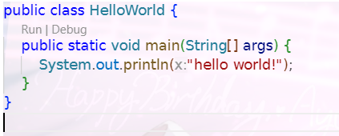

# 一、Java准备
## 1）准备
在oracle官网下载jdk（现在是jdk21），经测试完美运行。
## 2）第一个程序
代码如下：
```Java
public class HelloWorld {
	public static void main(String[] args) {
		System.out.println("hello world!");
	}
}
```
其中，源代码文件以及类名称必须使用大驼峰命名方式。文件后缀为.java。
## 3）JDK的组成
1. JVM：Java虚拟机，真正运行Java程序的地方。
2. 核心类库：Java自己写好的程序，给程序员自己的程序调用的。
3. JRE：Java的运行环境（JVM+核心类库）。
4. JDK：JRE和其他开发工具的集合。
## 4）环境变量的配置
搜索框搜索“环境变量”，点击环境变量相关部分，将我们的JDK路径（精确到bin）粘贴到Path栏中，然后就能在cmd或者powershell命令行中运行JDK了。
```powershell
	java --version
```
## 5）Java开发工具
目前主要的开发工具有：IDEA、Eclipse、vscode。前两者适合大型项目开发，vscode适合轻量级项目开发。
我们主要用IDEA与vscode进行学习。
上述三个配置方法已经学习过，无需再进行配置。
## 6）IDE开发程序
如图所示：

## 7）IDEA配置
同vscode，我们也可以对IDEA的主题进行设置，包括但不限于背景，明暗主题，缩放页面等操作。
### 1. IDEA常用快捷键
1. main/psvm —— 直接打出主函数（vscode适用）
2. "hello world!".sout  —— 直接打出System.out.println("hello world!");（vscode不适用）
3. ctrl+d —— 把当前行的代码直接复制到下一行（vscode为shift+Alt+↓）
4. ctrl+Y —— 删除当前行代码（vscode为ctrl+shift+k）
5. Alt+shift+↑与shift+Alt+↓（IDEA是上下移动代码，**vscode是上下复制代码**）
## 8）导入模块
比起直接用IDE导入模块，直接将项目通过资源管理器复制进项目大文件夹更好。

# 二、Java基础语法
## 1）注释
代码如下：
### 1. 单行注释
快捷键`Ctrl + /`
```Java
//これは一行のコメントです
```
### 2. 多行注释
快捷键`Ctrl + Shift + /`
```js
	/*　これは複数行のコメントです
	   Javaの学習に行くよ！*/
```
一般来说，单行注释比多行注释使用范围更多。
## 2）数据类型
### 1. 变量和数据类型
同C语言和JS，Java也有相似的数据类型。
1. 整数**int**型（如**111，-111**）（还有long long int等数据类型）
2. 小数**float**或者**double**型（如**13.14，-5.21**），使用float通常要在小数的后面加 **"f"**
3. 字符**char**型（如**A,a,我**），使用char时必须用**单引号（''）**
4. 字符串**String**型（如**abandon，学ぶ**），使用String时必须用**双引号（""）**
5. 布尔值**boolean**（即**true**和**false**，分别代表**真**和**假**）
6. 空值（**null**）
上述都是**变量名**，数据都可以被改变。
代码示例：
```Java
public class VariableDemo {  
    public static void main(String[] args) {  
        int a = 0;  
        float b = 1.11f;  
        double c = 1.11;  
        char d = 'こ';  
        String e = "こんにちは";  
        boolean f = true;  
        System.out.println(a);  
        System.out.println(b);  
        System.out.println(c);  
        System.out.println(d);  
        System.out.println(e);  
        System.out.println(f);  
        a = 1;  
        b = 2.22f;  
        c = 2.22;  
        d = 'に';  
        e = "こんばんは";  
        f = false;  
        System.out.println(a);  
        System.out.println(b);  
        System.out.println(c);  
        System.out.println(d);  
        System.out.println(e);  
        System.out.println(f);  
    }  
}
```
可以看到我们变量的数据被改变了。
### 2. 变量使用的注意事项
1. 变量必须**先声明后调用**
2. 变量在被调用时**必须有值** （即初始化）
3. 变量不能重名
4. 变量的作用域可能会有差别（一般来说，在函数体或者逻辑语句的内部的变量为**局部变量**，在main函数体里面的为**全局变量**）
```java
	int a = 0, b = 0;
	System.out.println(a);
```
### 3. 关键字
关键字主要是**public**，**class**，**int**，**double**...
这些关键字**不能设置为变量名**。
### 4. 标识符
- 标识符如**类名**，**变量名**等名字。
- 要求：
	- 基本组成：由数字，字母，下划线(\_)和美元符($)等组成
	- 强制要求：不能以数字**开头**，不能用**关键字作为名字**，且是区分大小写的（如PrintOutWord与printOutWord不是同一个关键字）
	- 命名规则：类名使用**大驼峰命名法**（如HelloWorld），变量名使用**小驼峰命名法**（如helloWorld）