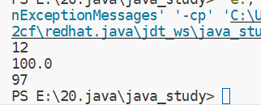

[接day1笔记 >](./Java笔记day1)
# 一、运算符与API
## 1）二进制，八进制与十六进制
在数字电路这门课中已讲，故不赘述。
## 2）数据类型
在昨天的笔记中已经提及，补充：long数据类型需要在数据后面加上L才能使用。
<a href="https://github.com/inabananami/obsidian-backup/blob/main/java%E7%AC%94%E8%AE%B0/Java%E7%AC%94%E8%AE%B0day1.md#2%E6%95%B0%E6%8D%AE%E7%B1%BB%E5%9E%8B" target="_blank">Java笔记day1-数据类型</a>
## 3）类型转换
### 1. 自动类型转换
- **类型范围小**的变量，可以**直接赋值**给**类型范围大**的变量。
程序实例：
```java
public class SortTurn {
    public static void main(String[] args) {
        //自動類型転換
        byte a = 12;
        int b = a;
        int c = 100;
        double d = c;
        char ch = 'a';
        int i = ch; //ASCllコードを出力
        //出力
        System.out.println(b);
        System.out.println(d);
        System.out.println(i);
    }
}

```
输出如图所示：

### 2. 表达式的自动类型转换
- 在表达式中，小范围类型的变量，会自动转换成表达式中较大范围的类型，再参与运算。
**注意事项：**
- 表达式的最终结果类型由表达式中的最高类型决定。
- **在表达式中，byte、short、char**是**直接转换成int**类型参与运算的。
代码示例：
```js
public class SortTurn2 {
    public static void main(String[] args) {
        //演算式の自動類型転換
        byte a = 10;
        int b = 20;
        long c = 30;
        // 最高の類型ではなければ、エラーが発生する
        // int rs = a + b + c;
        //最高の類型になれば、完璧になる
        long rs = a + b + c;
        System.err.println(rs);

        double rs2 = a + b + 1.0;
        System.out.println(rs2);

        byte i = 10;
        //この場合short型からint型まで転換する
        short j = 30; 
        int rs3 = i + j;
        System.out.println(rs3);
    }
}
```
### 3. 强制类型转换
指的是把大范围类型的变量转换为小范围类型的变量。
语法：
```java
int b = (byte) a;
```
程序示例：
```java
public class SortTurn3 {
    public static void main(String[] args) {
        int a = 0;
        byte b = (byte)a;
        //どちらとも0です
        System.out.println(a);
        System.out.println(b);
    }
}
```
如果数据过大，则会这样：
```java
	//cは10000だけど、Dは16です
	int c = 10000;
	byte d = (byte) c;
	System.out.println(d);
```
所以如果数据过大，强制转换会丢失数据。

## 4）算数运算符
### 1. 基本的算数运算符
分别是 **\+、 \-、 \*、\/**。
1. 其中 **\+** 既可以让两个变量相加，也可以在输出方法里链接字符串和数据。
2. 其他同c语言。
### 2. 自减自增运算符
分别是`++i`和`i++`、`i--`和`--i`
其中`++i`是先让i + 1，再获取i的值；`i++`则是先获取当前i的值，然后让i + 1。
自减运算符同理。
### 3. 赋值运算符
除`=`外还有`+=`,`-+`,`*=`,`/=`,`%=`。
例子：
- `a += b`就相当于`a = a + b`。
- `a -= b`就相当于`a = a - b`。
依次类推。
### 4. 关系运算符
分别是：
- >   是否大于
- >=  是否大于等于
- <   是否小于
- <=  是否小于等于
- ==  是否等于
- !=  是否不等于
上述运算符输出的是**布尔值**，即true和false。
### 5. 逻辑运算符
分别是：
- & 逻辑与
- |  逻辑或
- !  逻辑非
- ^  逻辑异或
还有：
- && 短路与
- || 短路或
上述两类区别是一个会计算所有值并比较，一个是当前面和后面的语句满足与和或的条件时，就不执行后面的语句了。称之为**逻辑短路**。
### 6. 三元运算符
即：`a>b?a:b`。
上述意思是：a是否大于b？是就输出a，不是就输出b。
## 5）Scanner API
我们可以这么使用Scanner接口来接受用户在键盘中输入的数据：
```java
//まずはAPIを導入する
import java.util.Scanner;

public class ScannerDemo {
    public static void main(String[] args) {
        //方法を宣言する
        Scanner scanner = new Scanner(System.in);
        int a;
        System.out.println("please input a number:");        
        a = scanner.nextInt();
        System.out.println("the nume your input is:"+a);
        scanner.close();
    }   
}
```
这样我们输入3，则程序会输出我们输入的3。