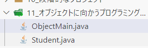

[接Java笔记day4 >](./Java笔记day4)
# 一、对象
## 1）创建对象并使用
在之前的学习中，我是在一个项目里创建并使用对象。但是在黑马的课程里，还有另外一个创建并使用对象的例子，如下：

创建对象代码如下：
```java
public class Student {
        String name;
        double point;
        String male;

        public void GetName() {
            System.out.println("the name is: "+name);
        }
        public void GetPoint() {
            System.out.println("the point is: "+point);
        }
}
```
使用对象代码如下：
```java
public class ObjectMain {
    public static void main(String[] args) {
        Student stu1 = new Student();
        stu1.name = "wang";
        stu1.male = "male";
        stu1.point = 80;
		//メモリーアドレスを出力する
        System.out.println(stu1);
        stu1.GetName();
        stu1.GetPoint();
    }    
}
```
可以输出姓名和分数。
## 2）this关键字
this就是一个变量，记录的是对象的内存地址。
代码示例：
1. 类：
```java
package ThisDemo.src;

public class Student {
    public void printThis() {
        //メモリーアドレスを出力する
        System.out.println(this);
    }
}

```
2. 主方法：
```java
package ThisDemo.src;

public class ObjectDemo2 {
    public static void main(String[] args) {
        Student s1 = new Student();
        //以下のオブジェクトはそれぞれのメモリーアドレスを出力する
        System.out.println(s1);
        s1.printThis();

        System.out.println("------------------------------------------------");

        Student s2 = new Student();
        System.out.println(s2);
        s2.printThis();
    }
}
```
this的应用场景：**解决变量名称冲突问题。**
代码示例：
```java
package ThisDemo.src;

public class Student {
    String name;
    String male;
    int point;
    public Student(String name, String male, int point) {
        //thisを加えなければ、変数の名称は衝突になる
        this.name = name;
        this.male = male;
        this.point = point;
    }
}
```
主方法：
```java
public class ObjectDemo2 {
    public static void main(String[] args) {
        Student s1 = new Student("wang", "male", 90);
        System.out.println(s1.name);
        System.out.println(s1.male);
        System.out.println(s1.point);
    }
}
```
可以正常构造对象并输出数据。
## 3）构造器
同cpp的构造函数，只不过要在前面加上"public"。
代码示例同 **2）this关键字**。
## 4）综合案例
需求：
- 展示系统中的全部电影(每部电影展示：名称、价格)。
- 允许用户根据电影编号（id）查询出某个电影的详细信息。
对象部分代码：
```java
package プロジェクト.src;

public class Movie {
    String[] name = new String[10];
    int[] price = new int[10];
    int[] id = new int[10];
    //初期化
    public Movie() {
        for(int i = 0; i < name.length; i++) {
            name[i] = "samplename"+(i+1);
            price[i] = 10 + i;
            id[i] = i + 1;
        }
    }
    
    public void GetInfo() {
        System.out.println("this is the movie now on cinema!");
        for(int i = 0; i < name.length; i++) {
            System.out.println(id[i]+" is: "+name[i]);
            System.out.println("the price is: "+price[i]);
        }
    }

    public void SearchById(int ID) {
        for(int i = 0; i < id.length; i++) {
            if(id[i] == ID) {
                System.out.println("the name of the "+id[i]+" movie is: "+name[i]);
                System.out.println("the price of this movie is: "+price[i]);
            }
        }
    }
}
```
主方法部分代码：
```java
package プロジェクト.src;
import java.util.Scanner;

public class MovieMain {
    public static void main(String[] args) {
       Movie m = new Movie();
       Scanner scanner = new Scanner(System.in);
       int ID = 0;
       int flag = 1;
       m.GetInfo();
       System.out.println("do you want to search your prefer movie? if yes, press 1, if no, press 2: ");
       flag = scanner.nextInt();
       if(flag == 1) {
            System.out.println("please input your prefer movie: ");
            ID = scanner.nextInt();
            m.SearchById(ID);
       }
       scanner.close();
    }
}
```