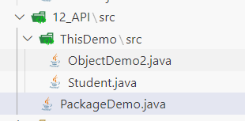

[接Java笔记day5 >](./Java笔记day5.md)

# 一、API
## 1）定义
别人写好的一些程序，程序员可直接调用它来解决问题。
## 2）包
### 1. 默认情况
IDE会自动帮我们建包。
代码如下：
```java
package pack.src;
public static void main(String[] args) {
	xxx...;
}
```
### 2. 在主包下调用其他的包
我们探讨的是如何调用其他的包。
程序格局如下：
Student是一个类，我们要在PackageDemo中使用这个类。



代码如下：
```java
//他のパッケージを使用するとき、importを使うべきです。
import ThisDemo.src.Student;

public class PackageDemo {
    public static void main(String[] args) {
        Student s1 = new Student("wang", "male", 80);
        System.out.println(s1.GetName());
    }
}
```
这样我们就能访问Student类了。
### 3. 调用Java默认的包。
如Scanner，我们就要使用`import java.util.Scanner;`，来导入scanner类。
## 3）String
### 1. 直接用String创建字符串。
代码如下：
```java
String name = "van";
```
其中name存储的是字符串的地址，但是System.out.Println打出来的是根据字符串地址查找出的字符串。
也可以使用：
```java
String s2 = new String("van");
```
### 2. 字符串工具
代码如下：
```java
public class StringMethod {
    public static void main(String[] args) {
        String name = "van";
        String name2 = "van";
        //stringの長さを獲得する
        int length = name.length();
        System.out.println(length);
        //stringの指定の位置のcharのAscllコードを獲得する
        int info_1 = name.charAt(1);
        System.out.println(info_1);
        //stringをchar配列を転換して返す
        char[] toChar = name.toCharArray();
        for(int i = 0; i < toChar.length; i++) {
            System.out.println(toChar[i]);
        }
        //string1とstring2の内容は同じかどうか確認する
        boolean isSame = name.equals(name2);
        System.out.println(isSame);
        //元stringの部分的な文字を獲得し、新たなstringを作成する(前を含んだが、後ろを含まない)
        String s3 = name.substring(0,2);
        System.out.println(s3);
        //元stringの特定な位置から始まり、後ろまで獲得し、新たなstringを作成する
        String s4 = name.substring(2);
        System.out.println(s4);
        //新しいデータを使い、Stringの古いものを差し替え、新たなstringを獲得する
        String s5 = name.replace('a','o');
        System.out.println(s5);
        //stringの中で特定なStringを含むかどうか判断する
        boolean IsTrue = name.contains("an");
        System.out.println(IsTrue);
        //stringは特定なStringで始まるかどうか判断する
        boolean IsStart = name.startsWith("va");
        System.out.println(IsStart);
        //stringを特定なStringを従って割り、String配列を返す
        String sample = "isthatTrue";
        String cut = "that";
        String[] cutted = sample.split(cut);
        System.out.println(cutted[1]);
    }
}
```
### 3. String使用时的注意事项
#### （1）字符串对象不可变
我们给用双引号定义的字符串添加新的字符串，只是分别放在堆内存常量里面，输出结合后的新内存地址，但是对象本身没有任何改变。
#### （2）new方式创建字符串
每new一次就会创建一个新的字符串，与直接使用双引号创建不同，每创建一次就会多一个全新的字符串对象。
### 4. String的应用案例
需求：系统正确的登录名和密码是：itheima/123456，请在控制台开发一个登录界面，接收用户输入的登录名和密码，判断用户是否登录成功，登录成功后展示：“欢迎进入系统！”，即可停止程序（注意：要求最多给用户三次登录机会）
代码如下：
```java
package StringProject.src;
import java.util.Scanner;

public class ProjectDemo {
    public static void main(String[] args) {
        Scanner scanner = new Scanner(System.in);
        String TrueAcc = "itheima";
        String TruePas = "123456";
        int count = 0;
        System.out.println("-------------------------------------------------");
        System.out.println("--------------welcome to our site! --------------");
            System.out.println("please input your account: ");
            String account = scanner.nextLine();
            System.out.println("please input your password: ");
            String password = scanner.nextLine();
            if(TrueAcc.equals(account) && TruePas.equals(password)) {
                System.out.println("login successed!");
            }
            while(!TruePas.equals(password)|| !TrueAcc.equals(account)) {
                System.out.println("your password or account is false");
                count++;
                System.out.println("you have "+count+" times to input");
                System.out.println("please input your account: ");
                account = scanner.nextLine();
                System.out.println("please input your password: ");
                password = scanner.nextLine();
                if(TrueAcc.equals(account) && TruePas.equals(password)) {
                    System.out.println("login successed!");
                    break;
                }
                if(count == 3) {
                    System.out.println("three times' appointment is over!");
                    break;
                }
            }
        scanner.close();
    }
}
```
## 4）ArrayList
### 1. 定义
**什么是集合？**
- 集合是一种容器，用来装数据的，类似于数组。
**有数组为什么还要集合？**
- 数组定义完成并启动后，**长度就固定了。** 但是集合的长度是不固定的。
**ArrayList**就是其中一个集合。
### 2. 创建ArrayList对象以及功能
在使用ArrayList时候，我们可以
最基本的ArrayList：
```java
	//ArrayListを作成する
	ArrayList list = new ArrayList();
	list.add(99);
	list.add("nijigasaki");
	list.add("raw");
	System.out.println(list);
```
特定类型的ArrayList：
```java
	//特定種類のArrayListを作成する
	ArrayList<Integer> list2 = new ArrayList<>();
	list2.add(99);
	list2.add(88);
	list2.add(11);
	System.out.println(list2);
```
在特定位置插入元素：
 ```java
	 //特定位置で要素を挿入する
	list2.add(1, 101);
	System.out.println(list2);
```
根据索引获取ArrayList的值：
```java
	//インデックスを従って、データを返す
	int num = list2.get(1);
	System.out.println(num);
```
获取集合中元素的个数：
```java
    //ArrayListの集合の数を獲得する
	int n = list2.size();
	System.out.println(n);
```
删除指定索引的元素，返回元素值：
```java
	//指定されたインデックスに対する要素を削除し、削除された要素を返す
	int num2 = list2.remove(2);
	System.out.println(num2);
	System.out.println(list2);
```
删除指定的元素，返回布尔值：
```java
	//指定された要素を削除し、削除する結果を返す
	boolean IsDel = list2.remove(Integer.valueOf(11));
	System.out.println(IsDel);
	System.out.println(list2);
```
修改指定索引处的值，返回修改前的值：
```java
        //指定されたインデックスのデータを直し、元のものを返す
	int num3 = list2.set(1,1000);
	System.out.println(num3);
	System.out.println(list2);
```
### 3. ArrayList的应用案例
需求：现在假如购物车中存储了如下这些商品：Java入门，宁夏枸杞，黑枸杞，人字拖，特级枸杞，枸杞子。现在用户不想买枸杞了，选择了批量删除，请完成该需求。
代码示例：
```java
package ArrayListProject.src;
import java.util.Scanner;
import java.util.ArrayList;

public class CartDemo {
    public static void main(String[] args) {
        System.setProperty("file.encoding", "UTF-8");
        Scanner scanner = new Scanner(System.in, "UTF-8");
        ArrayList<String> Cart = new ArrayList<>();
        String KeyWord;
        Cart.add("Javaの入門");
        Cart.add("お酒");
        Cart.add("ラブライブ！デイズ！");
        Cart.add("鹿の子の子");
        Cart.add("ぬまっちゃ");
        Cart.add("ディスプレイ2k144hzfast-ips");
        System.out.println("The thing what your bought are:");
        System.out.println(Cart);
        System.out.println("what item do you want to delete? please input the keyword: ");
        KeyWord = scanner.nextLine();
        System.out.println(KeyWord);
        for(int i = 0; i < Cart.size(); i++) {
            String Key = Cart.get(i);
            System.out.println(Key);
            if(Key.contains(KeyWord)) {
                Cart.remove(Key);
                i--;
            }
        }
        System.out.println(Cart);
        scanner.close();
    }    
}
```