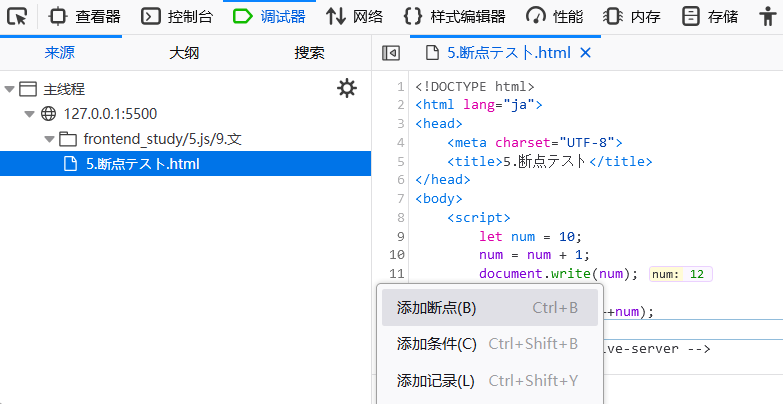

接js笔记day1内容：[[js笔记day1]]
GitHub外部链接：[js笔记day1](https://github.com/inabananami/obsidian-backup/blob/main/js%E7%AC%94%E8%AE%B0/js%E7%AC%94%E8%AE%B0day1.md)
## 11）运算符
### 1. 赋值运算符
**主要有下列赋值运算符：**
1. =（普通赋值，右边的值赋给左边）
2. +=（加赋值，右边的值加给左边）
3. \*=（乘赋值，右边的值乘给左边）
4. /=（除赋值，右边的值除给左边）
5. %=（取余赋值，右边的值与左边的值取余得到结果）
```js
	//以下は説明です
	let x= 4;
	document.write(x+=1);
	document.write("<br>");
	document.write(x-=1);
	document.write("<br>");
	document.write(x*=2);
	document.write("<br>");
	document.write(x/=2);
	document.write("<br>");
	document.write(x%=2);
	document.write("<br>");
```
### 2. 自增运算符
**代码如下：**
```js
	//例
	let x=1;
	let y=2;
	//前置インクリメント(ここのｘは2です)
	document.write(++x);
	document.write("<br>");
	//後置インクリメント（ここのｙは4であり、ｘはやはり２です）
	y+=x++;
	//yのデータは4です
	document.write(y);
	document.write("<br>")
	// ここのXはようやく3に増えた
	document.write(x);
```
### 3. 比较运算符
```js
	//例（結果は全部trueです）
	//1.等しい（ひとしい）
	let x = 1 == 1;
	document.write(x);
	document.write("<br>");
	//2.等しくない
	let y = 1 != 2;
	document.write(y);
	document.write("<br>");
	//3.より大きい
	let z = 2 > 1;
	document.write(z);
	document.write("<br>");
	//4.より小さい
	let a = 1 < 2;
	document.write(a);
	document.write("<br>");
	//5.より大きいか等しい
	let b = 2 >= 2;
	document.write(b);
	document.write("<br>");
	//6.より小さいか等しい
	let c = 1 <= 1;
	document.write(c);
	document.write("<br>");
	//7.char比較(ASCllコード)
	let d = 'a'>'A';
	document.write(d);
```
### 4. 逻辑运算符
主要有：
1. ！（非）（1 -> 0）(0 -> 1)
2. || （或）（1 1 -> 1）（1 0 或 0 1-> 1）（0 0 -> 0）
3. && （与）（11 -> 1）（其他全部情况为1)
## 12）语句
上述语句我们接触了**声明语句（let x；）**、**赋值语句（x = 5;）**、**表达式语句（x + y;）** 。接下来我们要接触**条件语句**以及**循环语句**。因为已在c语言中学习过，故不再详细说明。
### 1. if语句
```js
	let x = 1;
	let y = 2;
	//例1
	if (x < y){
		document.write("false");
	}
	//例2
	let a = 1;
	let b = 2;
	let c = 3;
	if (a < b) {
		if(b < c) {
			document.write("cは最も大きい数です");
		}
	}

	//例3
	let d = 90;
	if(d > 100 || d< 0) {
		document.write("点数が違いです。もう一度入力してください");
	}
	else if(d >= 90 && d<= 100) {
		document.write("優秀です");
	}
	else if(d >= 80 && d< 90) {
		document.write("良いです");
	}
	else if(d >= 71 && d< 80) {
		document.write("やや良いです");
	}
	else if(d>= 60 && d< 70) {
		document.write("合格です");
	}
	else {
		document.write("次に頑張りましょう");
	}
```
### 2. 三元运算符
```js
	//例
	let a = 1;
	let b = 2;
	(a > b) ? document.write(a) : document.write(b);
```
### \**3. 练习：自动补零*
介绍：用户输入1个数，如果数字小于10，则前面进行补0，比如 09 03 等。
```js
	let x = prompt("ある数字を入力してください:");
	while(x < 0) {
		x = prompt("エラーが発生しています。もう一度入力してください：");
	}
	if (x < 10) {
		document.write("0" + x);
	}
	else {
		document.write(x);
	}
```
### 4. switch分支语句
```js
//例
	let x = 2;
	switch (x) {
		default:
			document.write(x);
			break;
		case 1:
			document.write(++x);
			break;
		case 2:
			document.write(--x);
			break;
	}
```
### *5. 断点调试*
找到调试器 - 项目html文件，右键代码行数栏，选择添加断点。就可以看到num在代码行中的数值。

### 6. while循环
**while循环：** 在上面**练习：自动补零**中已经说明。
![[#*3.练习：自动补零*]]
### \**7.while循环练习*
**要求1：在页面内输出1-100**
```js
	//1.スクリーンで1から100まで出力します。
	let x= 1;
	while (x <= 100) {
		document.write(x++);
		document.write(" ");
	}
```
**要求2：在页面内输出1-100累加和**
```js
	//2.スクリーンで1から100までの和を出力します。
	let y = 1;
	let sum = 0;
	while (y <= 100) {
		sum += y;
		y++;
	}
	document.write(sum);
```
**要求3：在页面输出1-100的偶数和**
```js
	//3.スクリーンで1から100までの偶数和を出力します。
	let z = 1;
	let sum2 = 0;
	while (z <= 100) {
		if (z % 2 == 0) {
		sum2 += z;
		}
		z++;
	}
	document.write(sum2);
```
### 8. 退出循环
1. **continue：** 继续下一个循环，不终止循环。
2. **break：** 退出当前的循环。
```js
	//例（前のものは4前のデータだけ出力しますが、最後のには5だけ出力しない）
	let sum = 0;
	for (let i = 0; i < 10; i++) {
		if(i == 5) {
			break;
		}
		document.write(i);
	}
	document.write("<br>");
	for (let i = 0; i < 10; i++) {
		if(i == 5) {
			continue;
		}
		document.write(i);
	}
```
### *9. 综合案例 —— 简易ATM*
需求：用户可以选择存钱、取钱、查看余额和退出功能。
```js
let mode;
let input;
let output;
let search;
while(true) {
	mode = +prompt(`
	操作を選択してください：
		1. お預け入れ
		2. お引き出し
		3. 残高を見る
		4. キャンセル
	`);
	while (mode > 4 || mode < 0) {
		mode = +prompt("エラーが発生しました。もう一度入力してください：");
	}
	if (mode == 4) {
		alert("ご利用ありがとうございます！");
		break;
	}
	switch (mode) {
		case 1:
			input = +prompt("お預け入れの金額を確認してください：");
			while(input < 0) {
				input = +prompt("エラーが発生しました。もう一度入力してください：");
			}
			alert("ご利用ありがとうございます！");
			break;
		case 2:
			output = +prompt("お引き出しの金額を確認してください：");
			if(output > input || input <= 0) {
				alert("残高が足りておりません。あなたの残高は："+input+"円でございます。");
			}
			else {
				input -= output;
				alert("完了致しました。お金を忘れないようにしてください。");
			}
			break;
		case 3:
			alert("あなたの残高は："+input+"円でございます。");
			break;
	}
}
```
### 10. 冒泡排序
如代码所示：
```js
	let arr = [4,4,1,9,5,6,7,8];
	let temp = arr[0];
	document.write(arr);
	document.write("<br>");
	//降順ソート
	for(let i = 0; i < arr.length; i++) {
		for(let j = 0; j < arr.length - i - 1;j++){
			if(arr[j] < arr[j + 1]) {
				temp = arr[j];
				arr[j] = arr[j + 1];
				arr[j + 1] = temp;
			}
		}
	}
	document.write(arr);
	document.write("<br>");
	//昇順ソート
	for(let i = 0; i < arr.length; i++) {
		for(let j = 0; j < arr.length - i - 1;j++){
			if(arr[j] > arr[j + 1]) {
				temp = arr[j];
				arr[j] = arr[j + 1];
				arr[j + 1] = temp;
			}
		}
	}
	document.write(arr);
```