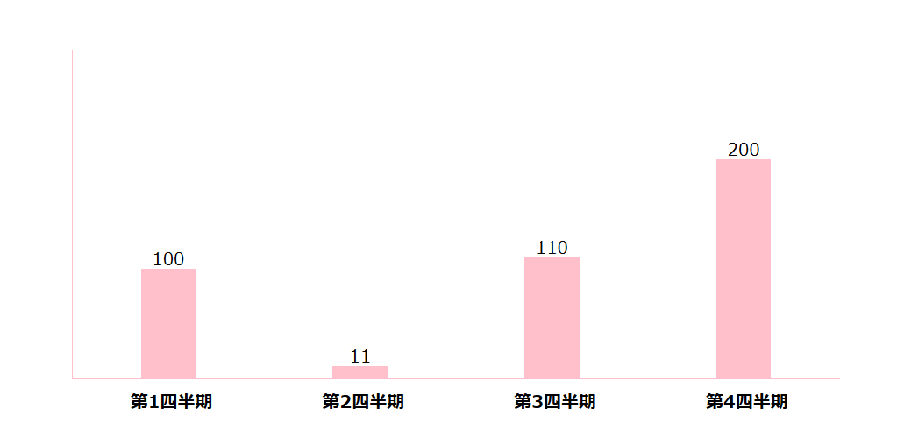

接day2内容：[js笔记day2 >](./js笔记day2.md)
### 11. for循环
见下链接
[退出循环 >](./js笔记day2.md#8.退出循环)
### 12. 遍历数组
同c语言，但可以比c语言更加简单，如**js笔记day1/1.数组的基本使用：**
[数组的基本使用 >](./js笔记day1#1.数组的基本使用)
```js
	//配列の宣言
	let num = [];
	//配列の割り当て
	num = [1,2,3];
	//配列の出力
	for(let i = 0; i < num.length; i++) {
		document.write(num[i]," ");
	}

	//文字があるなら、これで割り当てる
	let name = ["佐藤さん","戸山さん","上原さん"];
	for(let j = 0; j < name.length; j++) {
		document.write(name[j]," ");
	}
```
### 13. 循环嵌套
```js
	let num= [];
	num = [[1,2,3],[4,5,6],[7,8,9]];
	for(let i = 0; i < 3; i++) {
		for(let j = 0; j < 3;j++) {
			document.write(num[i][j]+"<br>");
		}
	}
```
### *14.循环嵌套大练习*
需求1：页面中打出5行5列的星星。
```js
	//5行5列の星を印刷する
	for(let i = 0;i < 5;i++) {
		for(let j = 0;j < 5; j++) {
			document.write("★");
		}
		document.write("<br>");
	}
```
需求2：在需求1的基础上，加入用户输入行数功能，打出对应的星星。
```js
	//ユーザー入力機能を追加する
	let row = +prompt("列数を入力してください：");
	let line = +prompt("行数を入力してください：");
	while(row <= 0) {
		row = +prompt("エラーが発生しました。列数をもう一度入力してください：");
	}
	while(line <= 0) {
		line = +prompt("エラーが発生しました。行数をもう一度入力してください：");
	}
	alert(`あなたが印刷したい星は${line}行${row}列です。`)
	//5行5列の星を印刷する
	for(let i = 0;i < row;i++) {
		for(let j = 0;j < line; j++) {
			document.write("★");
		}
		document.write("<br>");
	}
```
需求3：打印倒三角形星星。
```js
	//逆三角形を印刷する
	for(let i = 4; i >=0; i--) {
		for(let j = 0;j < 5-i;j++) {
			document.write("★");
		}
		document.write("<br>");
	}
```
需求4：打印乘法表
```js
	<script>
		//逆三角形を印刷する
		for(let i = 1; i <= 9; i--) {
			for(let j = 0;j <= i;j++) {
				document.write(`<div>${i}×${j}=${i * j}</div>`);
			}
			document.write(`<br>`);
		}
	</script>
```
### 10. 逻辑中断
**1. 逻辑运算符里的短路**
- 短路：只存在于 && 和 || 中，当满足一定条件会让右边代码不执行：
<table width="500px">
	<thead>
		<th>符号</th>
		<th>短路条件</th>
	</thead>
	<tbody>
		<tr>
			<td>&&</td>
			<td>左边为false就短路</td>
		</tr>
		<tr>
			<td>||</td>
			<td>左边为true就短路</td>
		</tr>
	</tbody>
</table>
例子：
```js
	let age = 18;
	console.log(false && age++);
	console.log(age);
	
	console.log(true || age++);
	console.log(age);
```
### 11. 转换为boolean型
其中,\`\`,0, undefined, NaN,  null等，转换为boolean都为false，其余都为true。
## 13）数组
### 1. 输出数组和和平均值
声明语法：
`let arr = new Array(data1, data2, ..datan)`
```js
	let sum = 0;
	let num = new Array(2,6,1,7,4);
	for(let i = 0; i < num.length;i++) {
		sum += num[i];
	}
	document.write(`和は${sum}です。`);
	document.write(`平均値は${sum / num.length}です。`);
```
### 2. 输出最大值和最小值
```js
	let num = new Array(2,6,1,77,52,25,7);
	let max = num[0];
	let min = num[0];
	for(let i = 0; i < num.length - 1;i++) {
			if(max < num[i]) {
				max = num[i]; 
			}
			else if(min > num[i]) {
				min = num[i];
			}
		}
	document.write(max);
	document.write(min);
```
### 3. 修改
```js
	//配列を直すコードです
	let num = new Array(2,6,1,77,52,25,7);
	let result = "";
	let x = 0;
	alert(`numはこうなっています：${num}`);
	x = +prompt(`直したい数の順番を入力してください`);
	x = x - 1;
	num2 = +prompt(`なおしたいの数を入力してください`);
	num[x] = num2;
	document.write(num);
```
### 4. 新增
```js
	let arr = new Array(1,5,4,6);
	// これは配列の後ろでデータを加える
	arr.push(7);
	//これは配列の前でデータを加える
	arr.unshift(8);
	//複数のデータを加えられる
	arr.push(9,10);
	document.write(arr);
```
### 5. *案例：数组筛选*
需求：将示例数组中大于等于10的元素筛选出来，放入新的数组
```js
	let arr = new Array(2,0,6,1,77,0,25,7);
	let new_arr = new Array();
	for(let i = 0; i< arr.length; i++) {
		if (arr[i] >= 10) {
			new_arr.push(arr[i]);
		}
	}
	for(let j = 0; j < arr.length;j++) {
		document.write(arr[j]+" ");
	}
	document.write("<br>");
	for(let k = 0; k <new_arr.length;k++) {
		document.write(new_arr[k]+" ");
	}
```
### 6. 删除
```js
	let arr = new Array(2,0,6,1,77,0,25,7);
	//これは配列の最後の要素を削除する方法です
	arr.pop();
	document.write(arr);
	document.write("<br>");
	//これは配列の最初の要素を削除する方法です
	arr.shift();
	document.write(arr);
	document.write("<br>");
	//一つの属性は配列の位置であり、二つの属性は削除したい要素の数です
	// arr.splice(start, 2);
	arr.splice(3,2);
	document.write(arr);
```
### *7.实例：输出柱形图*
需求：输入第一二三四季度数据，输出相应的柱形图。
**css样式：**
```css
	* {padding: 0;margin: 0;}
	.outer_box {
		display: flex;
		width: 700px;
		height: 300px;
		border-left: 1px solid pink;
		border-bottom: 1px solid pink;
		margin: 50px auto;
		justify-content: space-around;
		/* itemを底に整列にする */
		align-items: flex-end;
		text-align: center;
	}
	.outer_box>div {
		display: flex;
		width: 50px;
		background-color: pink;
		flex-direction: column;
		justify-content: space-between;
	}
	.outer_box div span {
		margin-top: -20px;
	}
	.box div {
		width: 70px;
		margin-left: -10px;
	}
	h4 {
		width: 80px;
		margin-left: -12px;
		margin-bottom: -35px;
	}
```
**js代码：**
```js
	let arr = [];
	for(let i = 1; i<=4;i++){
		arr.push(+prompt(`第${i}四半期のデータを入力してください：`));
	}
	console.log(arr);
	document.write(`<div class="outer_box">`);
	for(let i = 0; i < arr.length; i++) {
		document.write(`        
			<div style="height: ${arr[i]}px;">
				<span>${arr[i]}</span>
				<h4>第${i + 1}四半期</h4>
			</div>
		`);
	}
	document.write(`</div>`);
```
效果：
