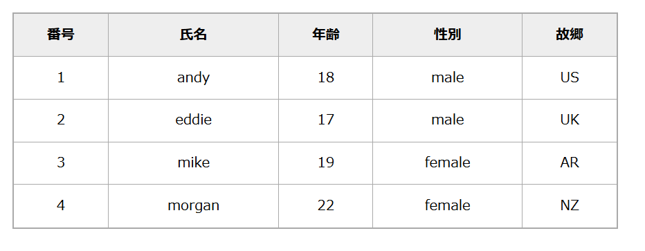

## 15）对象
### 1. 对象声明语法
```js
	//一つの方法
	let obj = {}
	//二つの方法
	let obj = new Object();
```
例：
```js
	let obj = {
		name: "wang",
		age: 18,
		gender: "female"
	}
	document.write(obj.name);
```
**注意：对象成员最后一个成员，不能加分号（;）**

**一次定义多个对象：**
可以将其包裹进数组里，但是对象头尾用中括号(\[ \])括起来。
```js
	let students = [
		{name: "andy", age: 18, gender: "male", hometown: "US"},
		{name: "eddie", age: 17, gender: "male", hometown: "UK"},
		{name: "mike", age: 19, gender: "feme", hometown: "AR"},
		{name: "morgan", age: 22, gender: "maalle", hometown: "NZ"}
	]
```
### 2.对象的增删改查
例子：
```js
	let obj = {
		name: "上原さん",
		"person-name": "前田さん",
		genter: "male",
		age: 50
	}
```
1. **增：**
```js
	//追加
	obj.hobby = "アイドル";
```
2. **删：**
```js
	//削除
	delete obj.age;
	document.write(obj.age);
```
3. **改：**
```js
	obj.name = "上原さん";
	document.write(obj.name);
```
1. **查：**
第一种方法：
```js
	document.write(obj.info_name);
```
第二种方法：
```js
	document.write(obj["person-name"]);
```
### 3. 对象的方法
基本结构如下：
```js
	sayHi: function() {
		document.write("hi~~");
	}
```
使用方法如下：
```js
	person.sayHi();
```
### 4. 对象的遍历
我们可以用`for(k...in obj) {}`的方法遍历对象。
例子：
```js
	let obj = {
		uname: "andy",
		age: 18,
		sex: "male"
	}
	for(let k in obj) {
		document.write(k);
		document.write(" ");
		//kを大カッコに包まれなければならない
		document.write(obj[k]);
		document.write("<br>");
	}
```
### *5.例 - 输出学生信息表*
需求：请将下列数据打印下来：
```js
	let students = [
		{name: "andy", age: 18, gender: "male", hometown: "US"},
		{name: "eddie", age: 17, gender: "male", hometown: "UK"},
		{name: "mike", age: 19, gender: "feme", hometown: "AR"},
		{name: "morgan", age: 22, gender: "maalle", hometown: "NZ"}
	]
```
输出代码：
```js
	for(let i = 0; i< students.length; i++) {
		for(let k in students[i]) {
			document.write(k);
			document.write(" ");
			document.write(students[i][k]);
			document.write("<br>");
		}
		document.write("<br>");
	}
```
输出表格的详细代码：
```js
<!DOCTYPE html>
<html lang="ja">
<head>
    <meta charset="UTF-8">
    <title>5.例-学生の情報表を出力</title>
    <style>
        table {
            width: 700px;
            height: 250px;
            border: 2px solid #aaa;
            border-collapse: collapse;
            text-align: center;
            margin: 0 auto;
            margin-top: 20px;
        }
        th {
            border: 1px solid #aaa;
            background-color: #eee;
        }
        td {
            border: 1px solid #aaa;
        }
    </style>
</head>
<body>
    <script>
        let students = [
            {name: "andy", age: 18, gender: "male", hometown: "US"},
            {name: "eddie", age: 17, gender: "male", hometown: "UK"},
            {name: "mike", age: 19, gender: "female", hometown: "AR"},
            {name: "morgan", age: 22, gender: "female", hometown: "NZ"}
        ]
        document.write("<table>");
        document.write(`
                <thead>
                    <th>番号</th>
                    <th>氏名</th>
                    <th>年齢</th>
                    <th>性別</th>
                    <th>故郷</th>
                </thead>
        `);
            document.write(`<tbody>`)
            for(let i = 0; i< students.length; i++) {
                document.write(`<tr>`);
                document.write(`<td>${i + 1}</td>`);
                for(let k in students[i]) {
                    document.write(`<td>${students[i][k]}</td>`);
                }
                document.write(`</tr>`);
            }
            document.write(`</tbody>`);
        document.write("</table>");
    </script>
</body>
</html>
```
效果如下：

以下是主要的内置对象：
```js
	//Mathという組込みオブジェクト
	//属性
	console.log(Math.PI);
	//方法
	//ceil  とは、上を向けて整数を取るものです
	console.log(Math.ceil(1.5));    //2
	console.log(Math.ceil(1.8));    //2
	//floor  とは、下に向けて整数をとるものです
	console.log(Math.floor(1.5));   //1
	console.log(Math.floor(1.8));   //1
	//round とは、四捨五入にするものです
	console.log(Math.round(1.5));   //2
	console.log(Math.round(1.1));   //1
	//max とは、数の中の最も大きいものを出力ものです
	console.log(Math.max(1,2,4,5,6,7,9));
```
### 7. 随机数函数
```js
	//1から10までのランダム数を出力する
	document.write(Math.floor(Math.random() * 11));
	document.write("<br>")
	//5から10までのランダム数を出力する
	document.write(Math.floor(Math.random() * 6)) + 5;
	//NからMまでのランダム数を出力する
	// document.write(Math.floor(Math.random() * (M-N+1))) + N;
```
### *8. 例1：随机点名*
```js
	let arr = ["佐藤さん","上原さん","前田さん","市ヶ谷さん","戸山さん","山吹さん","大西さん","大塚さん","鴨志田さん"];
	let i = Math.floor(Math.random() * (arr.length));
	document.write(`<div>${arr[i]}</div>`);
	//splice(start(array_num), delete (num) elements)
	//氏名を当たるなら削除する
	arr.splice(i,1);
	document.write("<br>");
	document.write(arr);
```
### *9. 例2：猜数字游戏*
需求：程序随机生成1~10之间的一个数字，用户输入一个数字
1. 如果大于该数字，就提示“数字猜大了”，继续猜
2. 如果小于该数字，就提示“数字猜小了”，继续猜
3. 如果猜对了，就提示猜对了，程序结束
```js
	let flag = 1;
	while (flag == 1) {
		let num = Math.floor(Math.random() * (9 + 1)) + 1;
		console.log(num);
		let guess = +prompt(`当てる数字を入力してください:`);
		while (guess != num) {
			if(guess > num) {
				guess = +prompt(`数字が大きすぎる。もう一度入力してください:`);
			}
			else if(guess < num) {
				guess = +prompt(`数値がを小さいすぎる。もう一度入力してください:`);
			}
		}
		if(guess == num) {
				alert(`当たったね！おめでとう！`);
		}
		flag = +prompt(`1を推したら、もう一度プレイする；2を推すと、退出する`);
	}
```
### *10. 例3：生成随机颜色*
需求：flag为true，生成hex颜色；flag为false，生成rgb颜色：
代码如下：
```js
function getRandomColor(flag) {
	if(flag) {
		let color = "#";
		for(let i = 1; i <= 6; i++) {
			let random_color = Math.floor(Math.random() * 16);
			if(random_color < 10) {
				color += random_color;
			}
			else if(random_color >=10 && random_color <= 15) {
				switch(random_color) {
					case 10:
						random_color = "A";
						color += random_color;
						break;
					case 11:
						random_color = "B";
						color += random_color;
						break;
					case 12:
						random_color = "C";
						color += random_color;
						break;
					case 13:
						random_color = "D";
						color += random_color;
						break;
					case 14:
						random_color = "E";
						color += random_color;
						break;
					case 15:
						random_color = "F";
						color += random_color;
						break;
				}
			}
		}
	return color;
	}
	else {
		let color2 = "rgb(";
		for(let i = 1; i <= 3; i++) {
			let random_color2 = Math.floor(Math.random() * 256);
			color2 += random_color2;
			if (i < 3) {
				color2 += ", ";
			}
		}
		color2 += ")";
	return color2;
	}
}
document.write(getRandomColor(true));
document.write("<br>");
document.write(getRandomColor(false));
document.write(`<div style="height: 200px; width: 200px; background-color: ${getRandomColor(true)}"></div>`);
document.write(`<div style="height: 200px; width: 200px; background-color: ${getRandomColor(false)}"></div>`);
```
